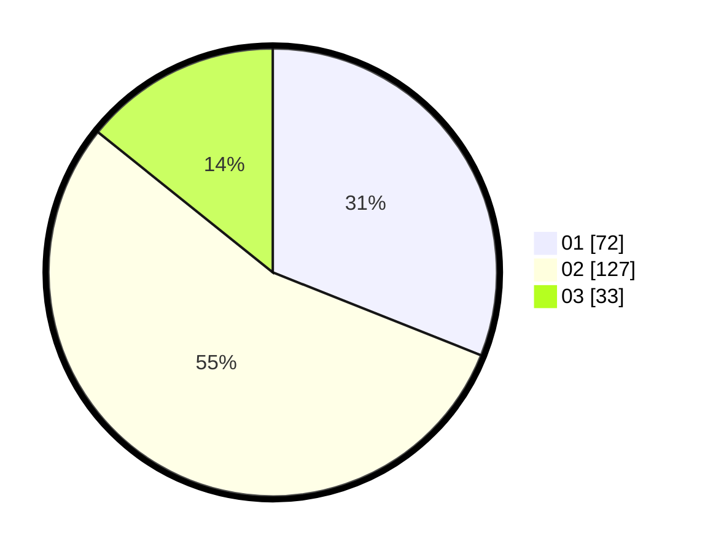

# Hasil

Hasil perolehan suara paslon dapat dilihat pada file paslon-01.txt, paslon-02.txt, dan paslon-03.txt.

Jika tidak ada, artinya data tersebut belum ada pada SIREKAP.

## Perolehan Suara

 * Paslon 01: **72**.
 * Paslon 02: **127**.
 * Paslon 03: **33**.

## Foto C Plano

https://sirekap-obj-formc.kpu.go.id/f2bc/pemilu/ppwp/31/72/02/10/02/3172021002039-20240217-174622--82308723-2b6c-488b-98b6-a0d54ec176dc.jpg

https://sirekap-obj-formc.kpu.go.id/f2bc/pemilu/ppwp/31/72/02/10/02/3172021002039-20240217-174642--399d0bca-d9d2-4554-940c-25125663e900.jpg

https://sirekap-obj-formc.kpu.go.id/f2bc/pemilu/ppwp/31/72/02/10/02/3172021002039-20240217-174702--5def607f-fd78-43ce-93b6-4e2713adc136.jpg

## DATA PEMILIH TETAP

Jumlah pemilih dalam DPT: **284**.
 * L: **142**.
 * P: **142**.

## DATA PENGGUNA HAK PILIH

Jumlah pengguna hak pilih dalam DPT: **233**.
 * L: **112**.
 * P: **121**.

Jumlah pengguna hak pilih dalam DPTb: **2**.
 * L: **1**.
 * P: **1**.

Jumlah pengguna hak pilih dalam DPK: **2**.
 * L: **2**.
 * P: **0**.

Jumlah pengguna hak pilih: **237**.
 * L: **115**.
 * P: **122**.

## JUMLAH SUARA SAH DAN TIDAK SAH

JUMLAH SELURUH SUARA SAH: **232**.

JUMLAH SUARA TIDAK SAH: **5**.

JUMLAH SELURUH SUARA SAH DAN SUARA TIDAK SAH: **237**.
