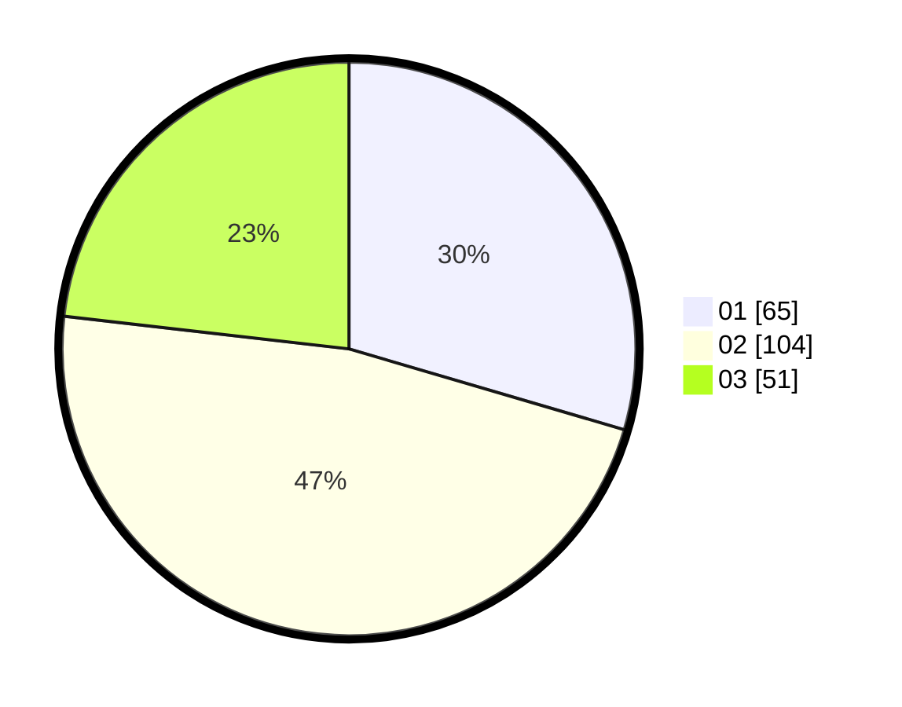

# Hasil

Hasil perolehan suara paslon dapat dilihat pada file paslon-01.txt, paslon-02.txt, dan paslon-03.txt.

Jika tidak ada, artinya data tersebut belum ada pada SIREKAP.

## Perolehan Suara

 * Paslon 01: **65**.
 * Paslon 02: **104**.
 * Paslon 03: **51**.

## Foto C Plano

https://sirekap-obj-formc.kpu.go.id/767c/pemilu/ppwp/31/72/02/10/02/3172021002041-20240217-175211--fe75b012-f001-4d03-867a-91ee564efdb9.jpg

https://sirekap-obj-formc.kpu.go.id/767c/pemilu/ppwp/31/72/02/10/02/3172021002041-20240217-175231--83f37b3d-2b09-4b04-bbb2-ae028a2d0dab.jpg

https://sirekap-obj-formc.kpu.go.id/767c/pemilu/ppwp/31/72/02/10/02/3172021002041-20240217-175251--9284158f-0124-48ee-9a15-a3fffed2f4ef.jpg

## DATA PEMILIH TETAP

Jumlah pemilih dalam DPT: **293**.
 * L: **136**.
 * P: **157**.

## DATA PENGGUNA HAK PILIH

Jumlah pengguna hak pilih dalam DPT: **219**.
 * L: **103**.
 * P: **116**.

Jumlah pengguna hak pilih dalam DPTb: **2**.
 * L: **1**.
 * P: **1**.

Jumlah pengguna hak pilih dalam DPK: **5**.
 * L: **3**.
 * P: **2**.

Jumlah pengguna hak pilih: **226**.
 * L: **107**.
 * P: **119**.

## JUMLAH SUARA SAH DAN TIDAK SAH

JUMLAH SELURUH SUARA SAH: **220**.

JUMLAH SUARA TIDAK SAH: **6**.

JUMLAH SELURUH SUARA SAH DAN SUARA TIDAK SAH: **226**.
