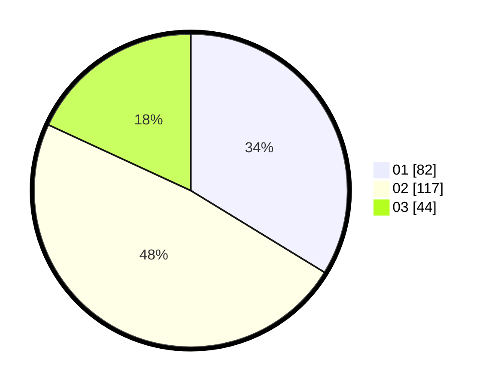

# Hasil

Hasil perolehan suara paslon dapat dilihat pada file paslon-01.txt, paslon-02.txt, dan paslon-03.txt.

Jika tidak ada, artinya data tersebut belum ada pada SIREKAP.

## Perolehan Suara

 * Paslon 01: **82**.
 * Paslon 02: **117**.
 * Paslon 03: **44**.

## Foto C Plano

https://sirekap-obj-formc.kpu.go.id/fc73/pemilu/ppwp/31/72/02/10/02/3172021002044-20240217-175523--6195958c-c109-44ee-bfb8-f7b2ecd3953a.jpg

https://sirekap-obj-formc.kpu.go.id/fc73/pemilu/ppwp/31/72/02/10/02/3172021002044-20240217-175546--31b3b203-8e55-480b-b189-e5dc0be3b3d9.jpg

https://sirekap-obj-formc.kpu.go.id/fc73/pemilu/ppwp/31/72/02/10/02/3172021002044-20240217-175609--e67f1b8d-0b64-4012-9a45-3caf707ca7bb.jpg

## DATA PEMILIH TETAP

Jumlah pemilih dalam DPT: **290**.
 * L: **130**.
 * P: **160**.

## DATA PENGGUNA HAK PILIH

Jumlah pengguna hak pilih dalam DPT: **243**.
 * L: **101**.
 * P: **142**.

Jumlah pengguna hak pilih dalam DPTb: **1**.
 * L: **1**.
 * P: **0**.

Jumlah pengguna hak pilih dalam DPK: **1**.
 * L: **1**.
 * P: **0**.

Jumlah pengguna hak pilih: **245**.
 * L: **103**.
 * P: **142**.

## JUMLAH SUARA SAH DAN TIDAK SAH

JUMLAH SELURUH SUARA SAH: **243**.

JUMLAH SUARA TIDAK SAH: **2**.

JUMLAH SELURUH SUARA SAH DAN SUARA TIDAK SAH: **245**.
