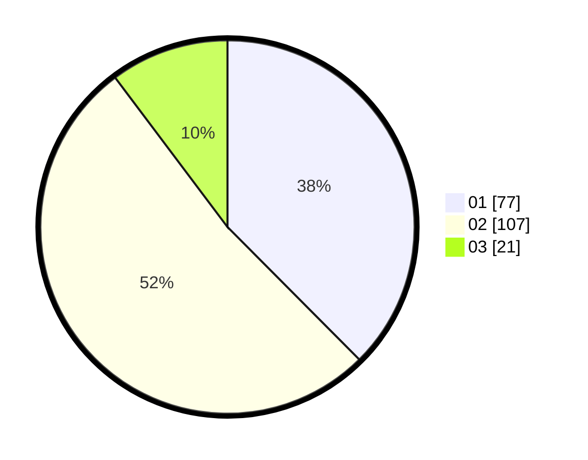

# Hasil

Hasil perolehan suara paslon dapat dilihat pada file paslon-01.txt, paslon-02.txt, dan paslon-03.txt.

Jika tidak ada, artinya data tersebut belum ada pada SIREKAP.

## Perolehan Suara

 * Paslon 01: **77**.
 * Paslon 02: **107**.
 * Paslon 03: **21**.

## Foto C Plano

https://sirekap-obj-formc.kpu.go.id/e0a7/pemilu/ppwp/31/72/02/10/02/3172021002047-20240217-195843--46fb3b0d-9a0d-4c30-bd8b-20bd5c5bdcc1.jpg

https://sirekap-obj-formc.kpu.go.id/e0a7/pemilu/ppwp/31/72/02/10/02/3172021002047-20240217-195915--5e57e006-2c03-4d1a-ae1b-dc9199ee0428.jpg

https://sirekap-obj-formc.kpu.go.id/e0a7/pemilu/ppwp/31/72/02/10/02/3172021002047-20240217-195948--352569f6-99e0-43e5-badf-3eefa25f60f4.jpg

## DATA PEMILIH TETAP

Jumlah pemilih dalam DPT: **285**.
 * L: **137**.
 * P: **148**.

## DATA PENGGUNA HAK PILIH

Jumlah pengguna hak pilih dalam DPT: **204**.
 * L: **95**.
 * P: **109**.

Jumlah pengguna hak pilih dalam DPTb: **0**.
 * L: **0**.
 * P: **0**.

Jumlah pengguna hak pilih dalam DPK: **3**.
 * L: **2**.
 * P: **1**.

Jumlah pengguna hak pilih: **207**.
 * L: **97**.
 * P: **110**.

## JUMLAH SUARA SAH DAN TIDAK SAH

JUMLAH SELURUH SUARA SAH: **205**.

JUMLAH SUARA TIDAK SAH: **2**.

JUMLAH SELURUH SUARA SAH DAN SUARA TIDAK SAH: **207**.
