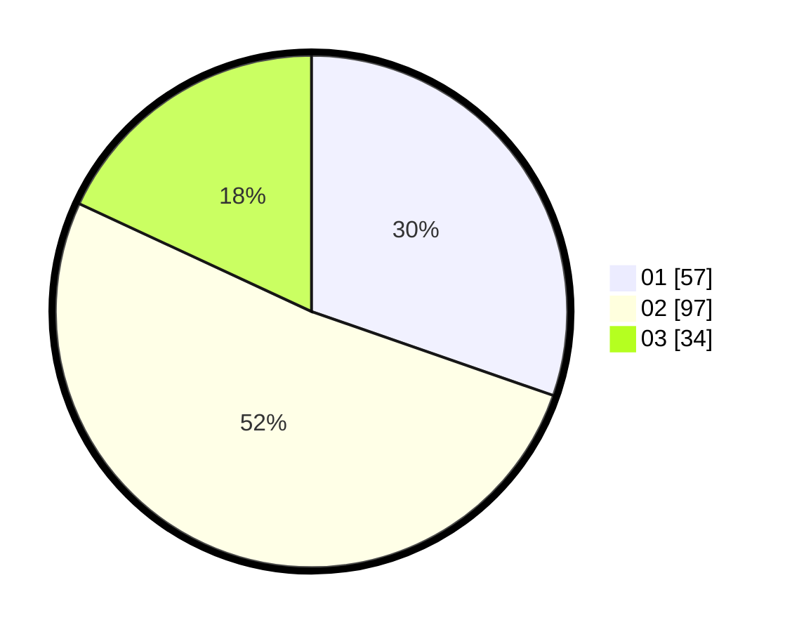

# Hasil

Hasil perolehan suara paslon dapat dilihat pada file paslon-01.txt, paslon-02.txt, dan paslon-03.txt.

Jika tidak ada, artinya data tersebut belum ada pada SIREKAP.

## Perolehan Suara

 * Paslon 01: **57**.
 * Paslon 02: **97**.
 * Paslon 03: **34**.

## Foto C Plano

https://sirekap-obj-formc.kpu.go.id/bfd5/pemilu/ppwp/31/72/02/10/02/3172021002053-20240217-202758--30291e2e-6911-413c-8865-b7b2550d3965.jpg

https://sirekap-obj-formc.kpu.go.id/bfd5/pemilu/ppwp/31/72/02/10/02/3172021002053-20240217-202819--2326ffb6-219d-4d5d-af89-ae709f0c7a47.jpg

https://sirekap-obj-formc.kpu.go.id/bfd5/pemilu/ppwp/31/72/02/10/02/3172021002053-20240217-202839--cf8bc4dc-da64-4035-9534-1773db340f35.jpg

## DATA PEMILIH TETAP

Jumlah pemilih dalam DPT: **287**.
 * L: **156**.
 * P: **131**.

## DATA PENGGUNA HAK PILIH

Jumlah pengguna hak pilih dalam DPT: **192**.
 * L: **99**.
 * P: **93**.

Jumlah pengguna hak pilih dalam DPTb: **0**.
 * L: **0**.
 * P: **0**.

Jumlah pengguna hak pilih dalam DPK: **0**.
 * L: **0**.
 * P: **0**.

Jumlah pengguna hak pilih: **192**.
 * L: **99**.
 * P: **93**.

## JUMLAH SUARA SAH DAN TIDAK SAH

JUMLAH SELURUH SUARA SAH: **188**.

JUMLAH SUARA TIDAK SAH: **4**.

JUMLAH SELURUH SUARA SAH DAN SUARA TIDAK SAH: **192**.
