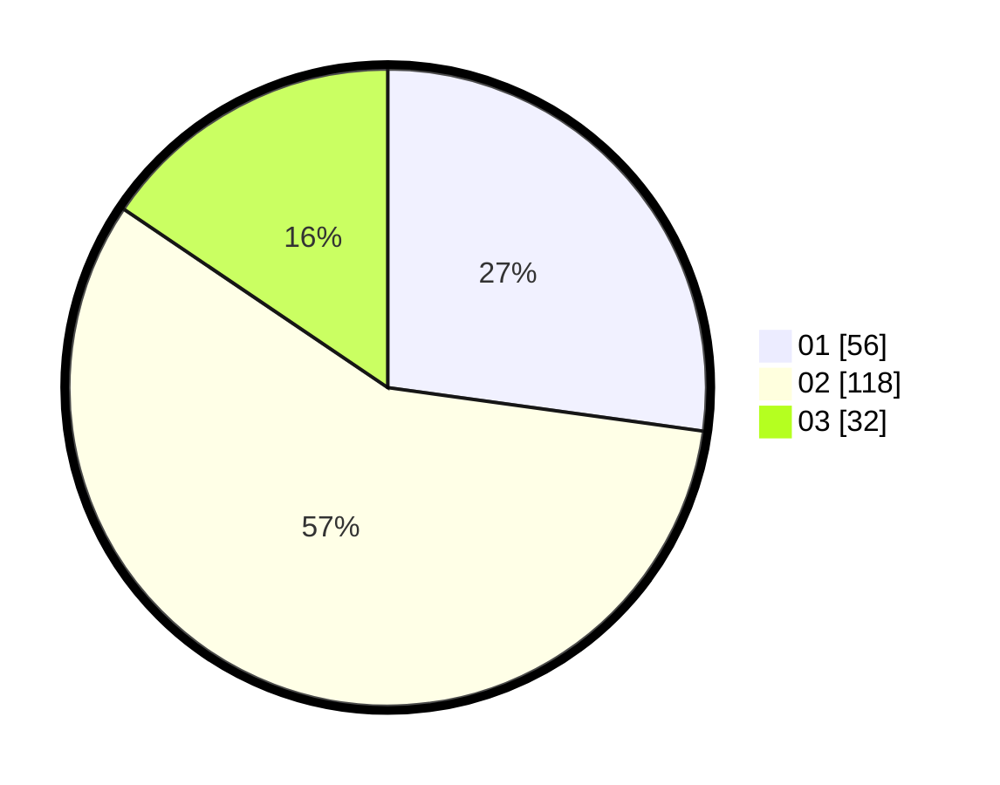

# Hasil

Hasil perolehan suara paslon dapat dilihat pada file paslon-01.txt, paslon-02.txt, dan paslon-03.txt.

Jika tidak ada, artinya data tersebut belum ada pada SIREKAP.

## Perolehan Suara

 * Paslon 01: **56**.
 * Paslon 02: **118**.
 * Paslon 03: **32**.

## Foto C Plano

https://sirekap-obj-formc.kpu.go.id/9236/pemilu/ppwp/31/72/02/10/02/3172021002057-20240217-204246--f1ad1f7d-e277-4ee4-8eae-d7492f880f24.jpg

https://sirekap-obj-formc.kpu.go.id/9236/pemilu/ppwp/31/72/02/10/02/3172021002057-20240217-204524--1f2d9c12-5a93-4986-80ba-c5c4a669d2c4.jpg

https://sirekap-obj-formc.kpu.go.id/9236/pemilu/ppwp/31/72/02/10/02/3172021002057-20240217-204658--be1ef919-5917-481e-8126-99632d78fe82.jpg

## DATA PEMILIH TETAP

Jumlah pemilih dalam DPT: **288**.
 * L: **148**.
 * P: **140**.

## DATA PENGGUNA HAK PILIH

Jumlah pengguna hak pilih dalam DPT: **209**.
 * L: **107**.
 * P: **102**.

Jumlah pengguna hak pilih dalam DPTb: **0**.
 * L: **0**.
 * P: **0**.

Jumlah pengguna hak pilih dalam DPK: **6**.
 * L: **2**.
 * P: **4**.

Jumlah pengguna hak pilih: **215**.
 * L: **109**.
 * P: **106**.

## JUMLAH SUARA SAH DAN TIDAK SAH

JUMLAH SELURUH SUARA SAH: **206**.

JUMLAH SUARA TIDAK SAH: **9**.

JUMLAH SELURUH SUARA SAH DAN SUARA TIDAK SAH: **215**.
