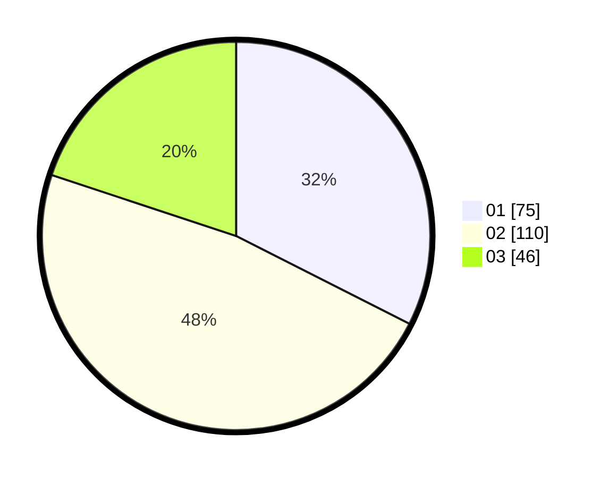

# Hasil

Hasil perolehan suara paslon dapat dilihat pada file paslon-01.txt, paslon-02.txt, dan paslon-03.txt.

Jika tidak ada, artinya data tersebut belum ada pada SIREKAP.

## Perolehan Suara

 * Paslon 01: **75**.
 * Paslon 02: **110**.
 * Paslon 03: **46**.

## Foto C Plano

https://sirekap-obj-formc.kpu.go.id/d44a/pemilu/ppwp/31/72/02/10/02/3172021002059-20240217-202142--a22b2c6c-c9f0-4047-a971-7837fcb4565e.jpg

https://sirekap-obj-formc.kpu.go.id/d44a/pemilu/ppwp/31/72/02/10/02/3172021002059-20240217-202214--9176e91d-dadc-4ad4-ad5f-de3d784bbeb5.jpg

https://sirekap-obj-formc.kpu.go.id/d44a/pemilu/ppwp/31/72/02/10/02/3172021002059-20240217-202235--3b6651f8-e946-4058-9870-5e8089164fe1.jpg

## DATA PEMILIH TETAP

Jumlah pemilih dalam DPT: **285**.
 * L: **142**.
 * P: **143**.

## DATA PENGGUNA HAK PILIH

Jumlah pengguna hak pilih dalam DPT: **227**.
 * L: **110**.
 * P: **117**.

Jumlah pengguna hak pilih dalam DPTb: **5**.
 * L: **3**.
 * P: **2**.

Jumlah pengguna hak pilih dalam DPK: **3**.
 * L: **0**.
 * P: **3**.

Jumlah pengguna hak pilih: **235**.
 * L: **113**.
 * P: **122**.

## JUMLAH SUARA SAH DAN TIDAK SAH

JUMLAH SELURUH SUARA SAH: **231**.

JUMLAH SUARA TIDAK SAH: **4**.

JUMLAH SELURUH SUARA SAH DAN SUARA TIDAK SAH: **235**.
