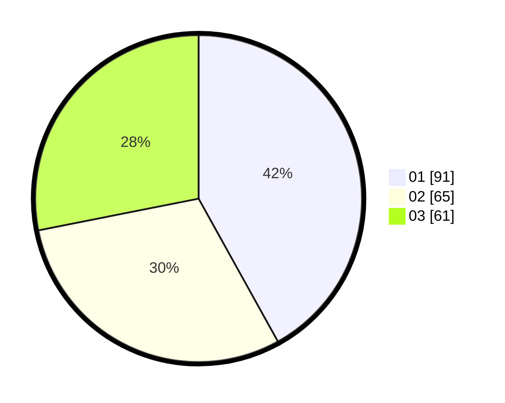

# Hasil

Hasil perolehan suara paslon dapat dilihat pada file paslon-01.txt, paslon-02.txt, dan paslon-03.txt.

Jika tidak ada, artinya data tersebut belum ada pada SIREKAP.

## Perolehan Suara

 * Paslon 01: **91**.
 * Paslon 02: **65**.
 * Paslon 03: **61**.

## Foto C Plano

https://sirekap-obj-formc.kpu.go.id/445c/pemilu/ppwp/31/72/02/10/02/3172021002067-20240216-215727--5eb78634-8881-48ef-ac2a-453c183aa522.jpg

https://sirekap-obj-formc.kpu.go.id/445c/pemilu/ppwp/31/72/02/10/02/3172021002067-20240216-220230--96bc9a09-ebeb-4994-8d1a-91c15d4637d6.jpg

https://sirekap-obj-formc.kpu.go.id/445c/pemilu/ppwp/31/72/02/10/02/3172021002067-20240216-220601--fdfefe1f-b2f0-4647-a378-4ae15e210e2c.jpg

## DATA PEMILIH TETAP

Jumlah pemilih dalam DPT: **272**.
 * L: **131**.
 * P: **141**.

## DATA PENGGUNA HAK PILIH

Jumlah pengguna hak pilih dalam DPT: **213**.
 * L: **99**.
 * P: **114**.

Jumlah pengguna hak pilih dalam DPTb: **3**.
 * L: **1**.
 * P: **2**.

Jumlah pengguna hak pilih dalam DPK: **2**.
 * L: **1**.
 * P: **1**.

Jumlah pengguna hak pilih: **218**.
 * L: **101**.
 * P: **117**.

## JUMLAH SUARA SAH DAN TIDAK SAH

JUMLAH SELURUH SUARA SAH: **217**.

JUMLAH SUARA TIDAK SAH: **1**.

JUMLAH SELURUH SUARA SAH DAN SUARA TIDAK SAH: **218**.
