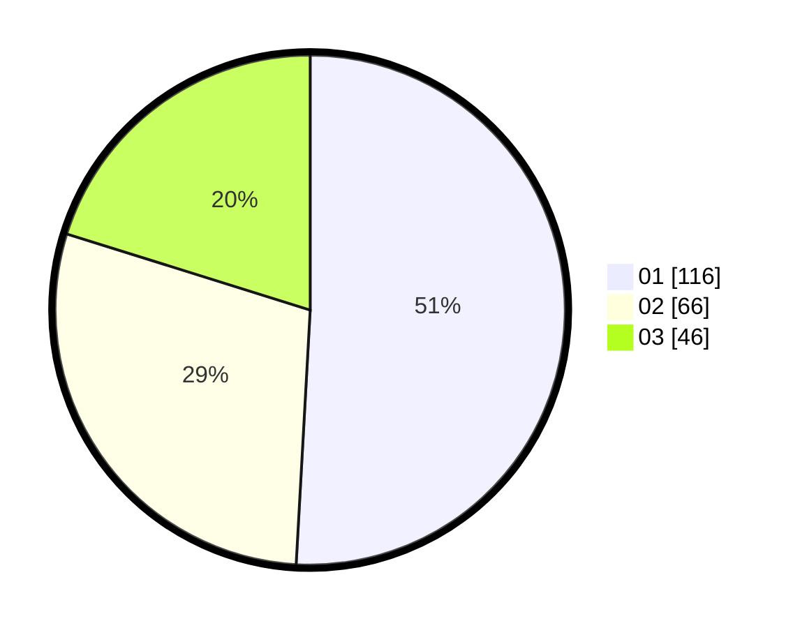

# Hasil

Hasil perolehan suara paslon dapat dilihat pada file paslon-01.txt, paslon-02.txt, dan paslon-03.txt.

Jika tidak ada, artinya data tersebut belum ada pada SIREKAP.

## Perolehan Suara

 * Paslon 01: **116**.
 * Paslon 02: **66**.
 * Paslon 03: **46**.

## Foto C Plano

https://sirekap-obj-formc.kpu.go.id/85c5/pemilu/ppwp/31/72/02/10/02/3172021002068-20240216-175527--027cc836-db42-4465-9b74-cf551a38165c.jpg

https://sirekap-obj-formc.kpu.go.id/85c5/pemilu/ppwp/31/72/02/10/02/3172021002068-20240216-190154--9443ff54-1aef-4f62-ab16-79c695087dd4.jpg

https://sirekap-obj-formc.kpu.go.id/85c5/pemilu/ppwp/31/72/02/10/02/3172021002068-20240216-181353--e20d8ab4-437f-4028-8da2-a4f52ed2198f.jpg

## DATA PEMILIH TETAP

Jumlah pemilih dalam DPT: **228**.
 * L: **105**.
 * P: **123**.

## DATA PENGGUNA HAK PILIH

Jumlah pengguna hak pilih dalam DPT: **221**.
 * L: **101**.
 * P: **120**.

Jumlah pengguna hak pilih dalam DPTb: **6**.
 * L: **4**.
 * P: **2**.

Jumlah pengguna hak pilih dalam DPK: **1**.
 * L: **0**.
 * P: **1**.

Jumlah pengguna hak pilih: **228**.
 * L: **105**.
 * P: **123**.

## JUMLAH SUARA SAH DAN TIDAK SAH

JUMLAH SELURUH SUARA SAH: **228**.

JUMLAH SUARA TIDAK SAH: **0**.

JUMLAH SELURUH SUARA SAH DAN SUARA TIDAK SAH: **228**.
