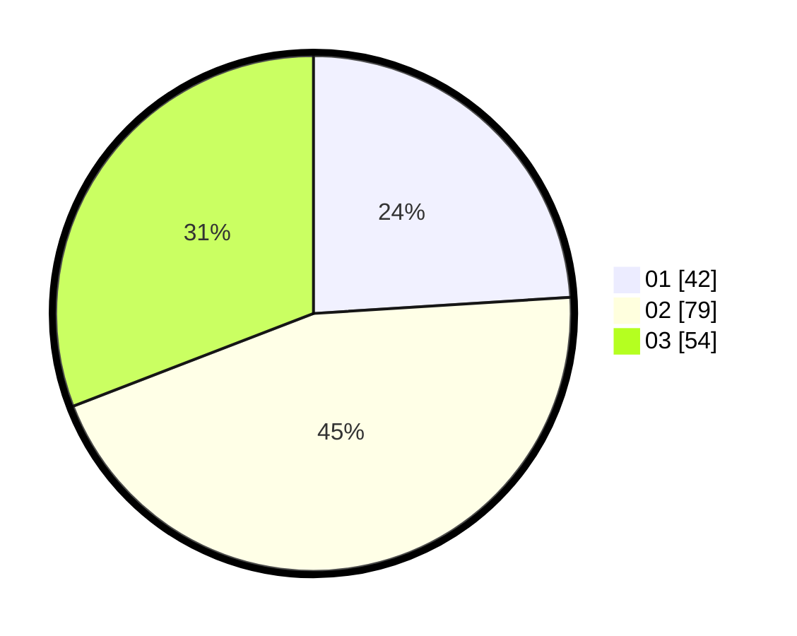

# Hasil

Hasil perolehan suara paslon dapat dilihat pada file paslon-01.txt, paslon-02.txt, dan paslon-03.txt.

Jika tidak ada, artinya data tersebut belum ada pada SIREKAP.

## Perolehan Suara

 * Paslon 01: **42**.
 * Paslon 02: **79**.
 * Paslon 03: **54**.

## Foto C Plano

https://sirekap-obj-formc.kpu.go.id/282b/pemilu/ppwp/31/72/02/10/02/3172021002071-20240214-155301--8fdff7f7-7b95-45d7-ba18-abadb9d5d65c.jpg

https://sirekap-obj-formc.kpu.go.id/282b/pemilu/ppwp/31/72/02/10/02/3172021002071-20240214-155458--e5f42dc9-21f5-4132-baf1-92be6894813f.jpg

https://sirekap-obj-formc.kpu.go.id/282b/pemilu/ppwp/31/72/02/10/02/3172021002071-20240214-155507--b9a9fd5d-ba6d-4191-a563-f23467ecb7db.jpg
