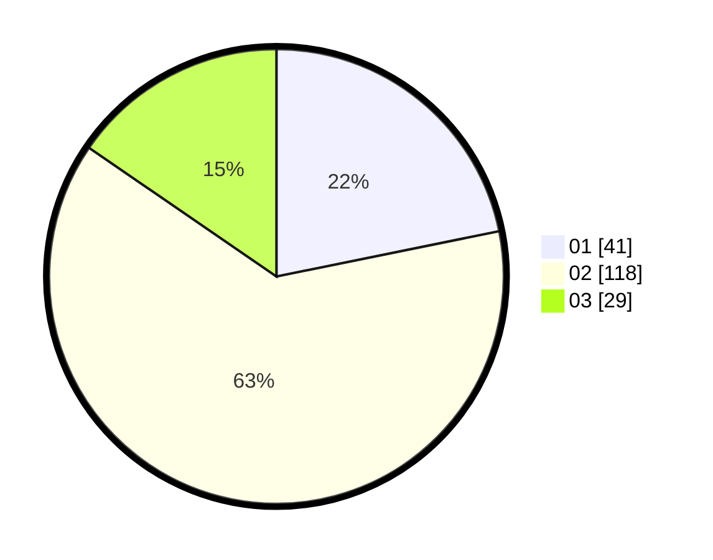

# Hasil

Hasil perolehan suara paslon dapat dilihat pada file paslon-01.txt, paslon-02.txt, dan paslon-03.txt.

Jika tidak ada, artinya data tersebut belum ada pada SIREKAP.

## Perolehan Suara

 * Paslon 01: **41**.
 * Paslon 02: **118**.
 * Paslon 03: **29**.

## Foto C Plano

https://sirekap-obj-formc.kpu.go.id/3a5a/pemilu/ppwp/31/72/02/10/02/3172021002114-20240214-233059--a56f2002-3165-434d-b227-2ea4facddb55.jpg

https://sirekap-obj-formc.kpu.go.id/3a5a/pemilu/ppwp/31/72/02/10/02/3172021002114-20240214-233222--0009d7f5-44b4-4329-b0ab-0ad38eec9afb.jpg

https://sirekap-obj-formc.kpu.go.id/3a5a/pemilu/ppwp/31/72/02/10/02/3172021002114-20240214-233321--98e500e3-aca5-46fa-a189-11e49789c4d9.jpg

## DATA PEMILIH TETAP

Jumlah pemilih dalam DPT: **284**.
 * L: **148**.
 * P: **136**.

## DATA PENGGUNA HAK PILIH

Jumlah pengguna hak pilih dalam DPT: **183**.
 * L: **92**.
 * P: **91**.

Jumlah pengguna hak pilih dalam DPTb: **3**.
 * L: **2**.
 * P: **1**.

Jumlah pengguna hak pilih dalam DPK: **2**.
 * L: **0**.
 * P: **2**.

Jumlah pengguna hak pilih: **188**.
 * L: **94**.
 * P: **94**.

## JUMLAH SUARA SAH DAN TIDAK SAH

JUMLAH SELURUH SUARA SAH: **188**.

JUMLAH SUARA TIDAK SAH: **0**.

JUMLAH SELURUH SUARA SAH DAN SUARA TIDAK SAH: **188**.
