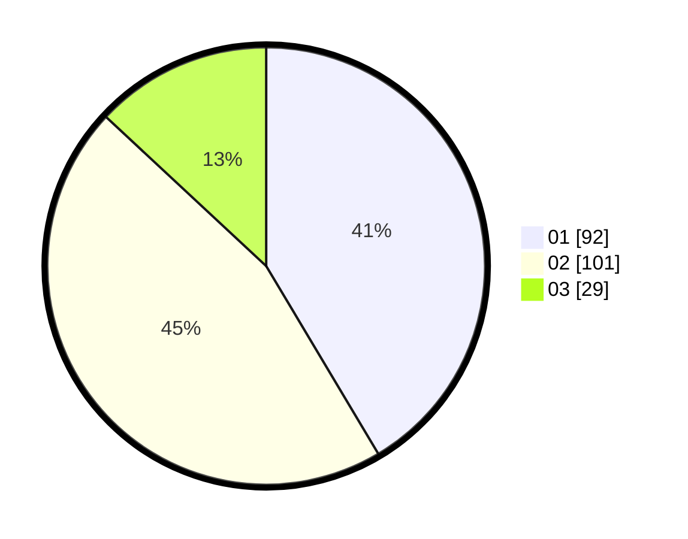

# Hasil

Hasil perolehan suara paslon dapat dilihat pada file paslon-01.txt, paslon-02.txt, dan paslon-03.txt.

Jika tidak ada, artinya data tersebut belum ada pada SIREKAP.

## Perolehan Suara

 * Paslon 01: **92**.
 * Paslon 02: **101**.
 * Paslon 03: **29**.

## Foto C Plano

https://sirekap-obj-formc.kpu.go.id/4988/pemilu/ppwp/31/72/02/10/02/3172021002132-20240216-055844--4076fc4d-fea6-4c3e-b454-ef378e58a638.jpg

https://sirekap-obj-formc.kpu.go.id/4988/pemilu/ppwp/31/72/02/10/02/3172021002132-20240216-055846--6028c28d-3642-41e2-a3dd-f0f4299c5a84.jpg

https://sirekap-obj-formc.kpu.go.id/4988/pemilu/ppwp/31/72/02/10/02/3172021002132-20240216-055845--1add0f38-b513-4961-8fd3-aff1d9cecdf7.jpg

## DATA PEMILIH TETAP

Jumlah pemilih dalam DPT: **297**.
 * L: **142**.
 * P: **155**.

## DATA PENGGUNA HAK PILIH

Jumlah pengguna hak pilih dalam DPT: **220**.
 * L: **96**.
 * P: **124**.

Jumlah pengguna hak pilih dalam DPTb: **5**.
 * L: **3**.
 * P: **2**.

Jumlah pengguna hak pilih dalam DPK: **0**.
 * L: **0**.
 * P: **0**.

Jumlah pengguna hak pilih: **225**.
 * L: **99**.
 * P: **126**.

## JUMLAH SUARA SAH DAN TIDAK SAH

JUMLAH SELURUH SUARA SAH: **222**.

JUMLAH SUARA TIDAK SAH: **3**.

JUMLAH SELURUH SUARA SAH DAN SUARA TIDAK SAH: **225**.
