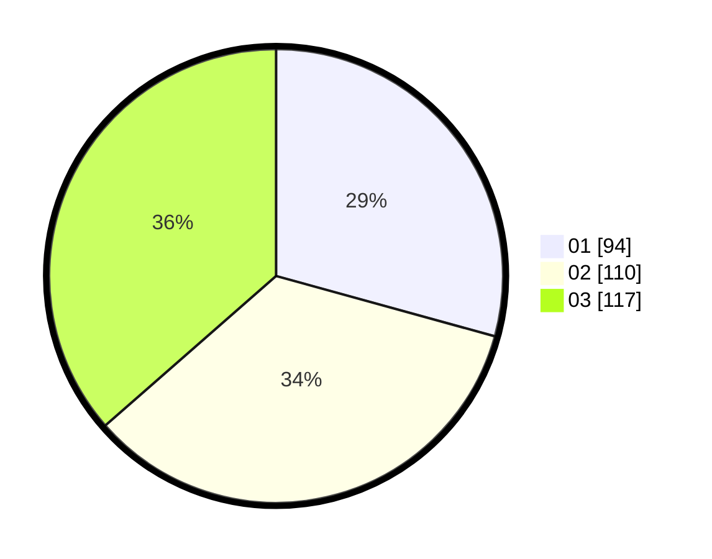

# Hasil

Hasil perolehan suara paslon dapat dilihat pada file paslon-01.txt, paslon-02.txt, dan paslon-03.txt.

Jika tidak ada, artinya data tersebut belum ada pada SIREKAP.

## Perolehan Suara

 * Paslon 01: **94**.
 * Paslon 02: **110**.
 * Paslon 03: **117**.

## Foto C Plano

https://sirekap-obj-formc.kpu.go.id/79c8/pemilu/ppwp/31/72/02/10/02/3172021002169-20240214-235631--c2fcf133-7fac-4a41-a3ca-039ca43dfc5d.jpg

https://sirekap-obj-formc.kpu.go.id/79c8/pemilu/ppwp/31/72/02/10/02/3172021002169-20240214-235639--442db7a6-25f4-4bab-8e55-9657690574c6.jpg

https://sirekap-obj-formc.kpu.go.id/79c8/pemilu/ppwp/31/72/02/10/02/3172021002169-20240214-235702--0c92ade2-ef03-4bb0-8b7e-f555db25e212.jpg

## DATA PEMILIH TETAP

Jumlah pemilih dalam DPT: **295**.
 * L: **140**.
 * P: **155**.

## DATA PENGGUNA HAK PILIH

Jumlah pengguna hak pilih dalam DPT: **216**.
 * L: **102**.
 * P: **114**.

Jumlah pengguna hak pilih dalam DPTb: **8**.
 * L: **3**.
 * P: **5**.

Jumlah pengguna hak pilih dalam DPK: **13**.
 * L: **3**.
 * P: **10**.

Jumlah pengguna hak pilih: **237**.
 * L: **108**.
 * P: **129**.

## JUMLAH SUARA SAH DAN TIDAK SAH

JUMLAH SELURUH SUARA SAH: **236**.

JUMLAH SUARA TIDAK SAH: **1**.

JUMLAH SELURUH SUARA SAH DAN SUARA TIDAK SAH: **237**.
