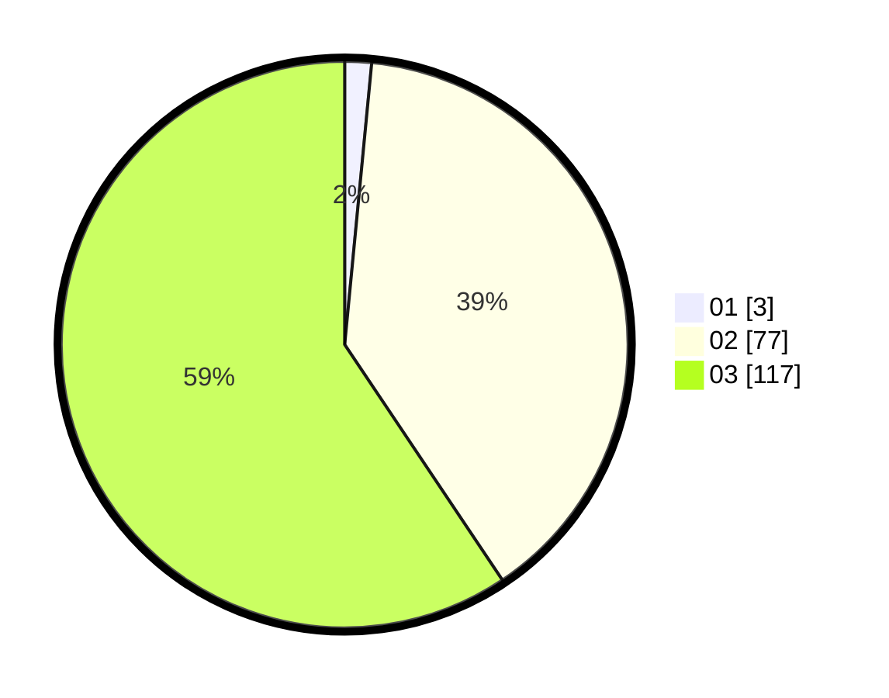

# Hasil

Hasil perolehan suara paslon dapat dilihat pada file paslon-01.txt, paslon-02.txt, dan paslon-03.txt.

Jika tidak ada, artinya data tersebut belum ada pada SIREKAP.

## Perolehan Suara

 * Paslon 01: **3**.
 * Paslon 02: **77**.
 * Paslon 03: **117**.

## Foto C Plano

https://sirekap-obj-formc.kpu.go.id/bcd2/pemilu/ppwp/31/72/02/10/02/3172021002194-20240214-191240--db603afb-6b22-48d9-973b-e2cb47c2960d.jpg

https://sirekap-obj-formc.kpu.go.id/bcd2/pemilu/ppwp/31/72/02/10/02/3172021002194-20240214-190900--c3f2af83-e505-4a0f-802e-3534a9f08d99.jpg

https://sirekap-obj-formc.kpu.go.id/bcd2/pemilu/ppwp/31/72/02/10/02/3172021002194-20240214-191746--ef54ec86-8de3-4f1a-9b5b-26da67abf8f7.jpg

## DATA PEMILIH TETAP

Jumlah pemilih dalam DPT: **278**.
 * L: **118**.
 * P: **160**.

## DATA PENGGUNA HAK PILIH

Jumlah pengguna hak pilih dalam DPT: **190**.
 * L: **82**.
 * P: **108**.

Jumlah pengguna hak pilih dalam DPTb: **6**.
 * L: **0**.
 * P: **6**.

Jumlah pengguna hak pilih dalam DPK: **2**.
 * L: **1**.
 * P: **1**.

Jumlah pengguna hak pilih: **198**.
 * L: **83**.
 * P: **115**.

## JUMLAH SUARA SAH DAN TIDAK SAH

JUMLAH SELURUH SUARA SAH: **197**.

JUMLAH SUARA TIDAK SAH: **1**.

JUMLAH SELURUH SUARA SAH DAN SUARA TIDAK SAH: **198**.
