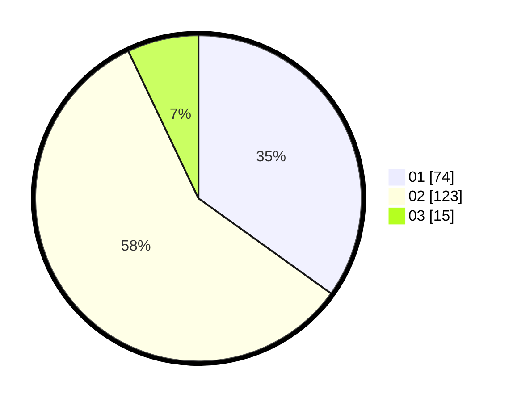

# Hasil

Hasil perolehan suara paslon dapat dilihat pada file paslon-01.txt, paslon-02.txt, dan paslon-03.txt.

Jika tidak ada, artinya data tersebut belum ada pada SIREKAP.

## Perolehan Suara

 * Paslon 01: **74**.
 * Paslon 02: **123**.
 * Paslon 03: **15**.

## Foto C Plano

https://sirekap-obj-formc.kpu.go.id/269c/pemilu/ppwp/31/72/02/10/03/3172021003002-20240214-212106--b1f34fe6-7ea3-4cb0-b66c-272fe9d0eed7.jpg

https://sirekap-obj-formc.kpu.go.id/269c/pemilu/ppwp/31/72/02/10/03/3172021003002-20240214-203349--3527818c-5188-4dae-ad5c-41844cc69e30.jpg

https://sirekap-obj-formc.kpu.go.id/269c/pemilu/ppwp/31/72/02/10/03/3172021003002-20240214-203458--c981ed69-cb00-4616-b7ec-acb3bf27b0ba.jpg

## DATA PEMILIH TETAP

Jumlah pemilih dalam DPT: **287**.
 * L: **145**.
 * P: **142**.

## DATA PENGGUNA HAK PILIH

Jumlah pengguna hak pilih dalam DPT: **216**.
 * L: **103**.
 * P: **113**.

Jumlah pengguna hak pilih dalam DPTb: **0**.
 * L: **0**.
 * P: **0**.

Jumlah pengguna hak pilih dalam DPK: **1**.
 * L: **0**.
 * P: **1**.

Jumlah pengguna hak pilih: **217**.
 * L: **103**.
 * P: **114**.

## JUMLAH SUARA SAH DAN TIDAK SAH

JUMLAH SELURUH SUARA SAH: **212**.

JUMLAH SUARA TIDAK SAH: **5**.

JUMLAH SELURUH SUARA SAH DAN SUARA TIDAK SAH: **217**.
