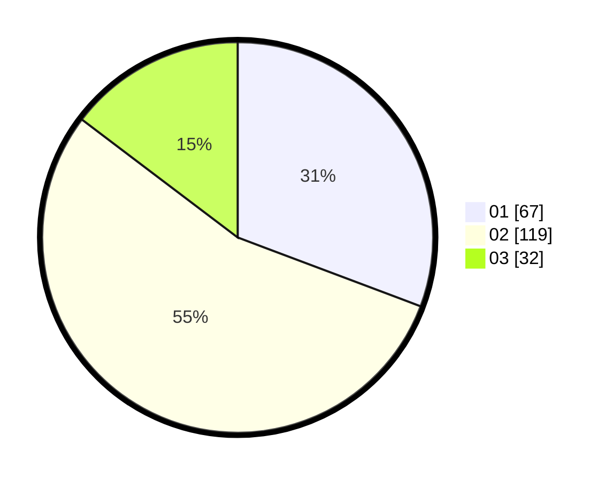

# Hasil

Hasil perolehan suara paslon dapat dilihat pada file paslon-01.txt, paslon-02.txt, dan paslon-03.txt.

Jika tidak ada, artinya data tersebut belum ada pada SIREKAP.

## Perolehan Suara

 * Paslon 01: **67**.
 * Paslon 02: **119**.
 * Paslon 03: **32**.

## Foto C Plano

https://sirekap-obj-formc.kpu.go.id/2d02/pemilu/ppwp/31/72/02/10/03/3172021003004-20240214-200548--347b20e9-5586-4b6c-968f-7abf69690d19.jpg

https://sirekap-obj-formc.kpu.go.id/2d02/pemilu/ppwp/31/72/02/10/03/3172021003004-20240214-200642--746a488a-6ed1-4394-9e0c-45134e4925ca.jpg

https://sirekap-obj-formc.kpu.go.id/2d02/pemilu/ppwp/31/72/02/10/03/3172021003004-20240214-200730--96b5134e-47fd-4b74-a66d-c7095941e815.jpg

## DATA PEMILIH TETAP

Jumlah pemilih dalam DPT: **291**.
 * L: **144**.
 * P: **147**.

## DATA PENGGUNA HAK PILIH

Jumlah pengguna hak pilih dalam DPT: **214**.
 * L: **98**.
 * P: **116**.

Jumlah pengguna hak pilih dalam DPTb: **0**.
 * L: **0**.
 * P: **0**.

Jumlah pengguna hak pilih dalam DPK: **6**.
 * L: **3**.
 * P: **3**.

Jumlah pengguna hak pilih: **220**.
 * L: **101**.
 * P: **119**.

## JUMLAH SUARA SAH DAN TIDAK SAH

JUMLAH SELURUH SUARA SAH: **218**.

JUMLAH SUARA TIDAK SAH: **2**.

JUMLAH SELURUH SUARA SAH DAN SUARA TIDAK SAH: **220**.
