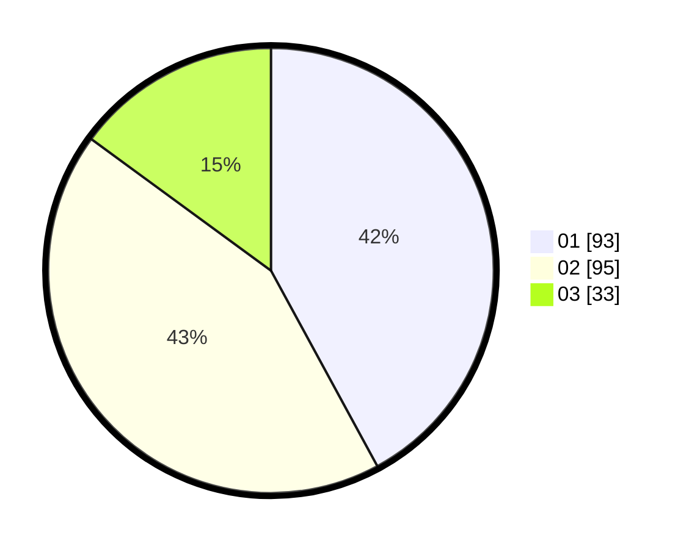

# Hasil

Hasil perolehan suara paslon dapat dilihat pada file paslon-01.txt, paslon-02.txt, dan paslon-03.txt.

Jika tidak ada, artinya data tersebut belum ada pada SIREKAP.

## Perolehan Suara

 * Paslon 01: **93**.
 * Paslon 02: **95**.
 * Paslon 03: **33**.

## Foto C Plano

https://sirekap-obj-formc.kpu.go.id/d158/pemilu/ppwp/31/72/02/10/03/3172021003013-20240214-224001--0c548776-ae2e-49ea-b78f-515e5015bcec.jpg

https://sirekap-obj-formc.kpu.go.id/d158/pemilu/ppwp/31/72/02/10/03/3172021003013-20240214-223735--db7963e4-c4fe-477b-8f77-f2653aaa76ea.jpg

https://sirekap-obj-formc.kpu.go.id/d158/pemilu/ppwp/31/72/02/10/03/3172021003013-20240214-224101--1a8e2039-41bb-4fec-a30b-0255bd53c37f.jpg

## DATA PEMILIH TETAP

Jumlah pemilih dalam DPT: **281**.
 * L: **137**.
 * P: **144**.

## DATA PENGGUNA HAK PILIH

Jumlah pengguna hak pilih dalam DPT: **216**.
 * L: **104**.
 * P: **112**.

Jumlah pengguna hak pilih dalam DPTb: **5**.
 * L: **4**.
 * P: **1**.

Jumlah pengguna hak pilih dalam DPK: **1**.
 * L: **1**.
 * P: **0**.

Jumlah pengguna hak pilih: **222**.
 * L: **109**.
 * P: **113**.

## JUMLAH SUARA SAH DAN TIDAK SAH

JUMLAH SELURUH SUARA SAH: **221**.

JUMLAH SUARA TIDAK SAH: **1**.

JUMLAH SELURUH SUARA SAH DAN SUARA TIDAK SAH: **222**.
