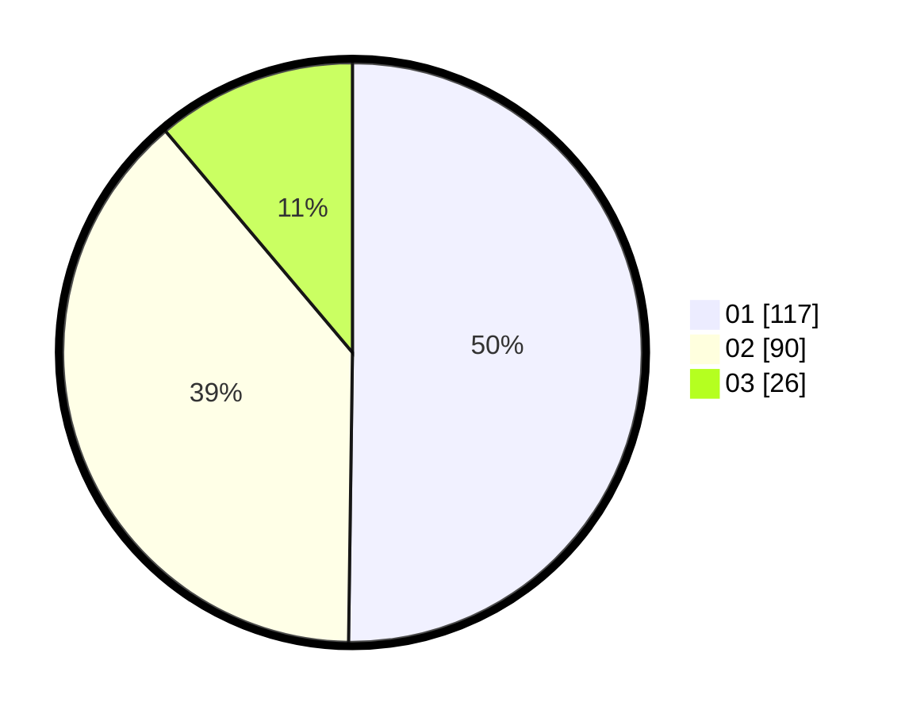

# Hasil

Hasil perolehan suara paslon dapat dilihat pada file paslon-01.txt, paslon-02.txt, dan paslon-03.txt.

Jika tidak ada, artinya data tersebut belum ada pada SIREKAP.

## Perolehan Suara

 * Paslon 01: **117**.
 * Paslon 02: **90**.
 * Paslon 03: **26**.

## Foto C Plano

https://sirekap-obj-formc.kpu.go.id/892b/pemilu/ppwp/31/72/02/10/03/3172021003023-20240214-230942--a7891d69-2443-4ebe-8a3e-889ba2463306.jpg

https://sirekap-obj-formc.kpu.go.id/892b/pemilu/ppwp/31/72/02/10/03/3172021003023-20240216-164636--a1d9b6c1-a369-4d4e-8c47-13ce8bac3506.jpg

https://sirekap-obj-formc.kpu.go.id/892b/pemilu/ppwp/31/72/02/10/03/3172021003023-20240216-165233--5ae0a2f8-f917-4c4b-9ecc-83121da1d35a.jpg

## DATA PEMILIH TETAP

Jumlah pemilih dalam DPT: **299**.
 * L: **144**.
 * P: **155**.

## DATA PENGGUNA HAK PILIH

Jumlah pengguna hak pilih dalam DPT: **238**.
 * L: **112**.
 * P: **126**.

Jumlah pengguna hak pilih dalam DPTb: **0**.
 * L: **0**.
 * P: **0**.

Jumlah pengguna hak pilih dalam DPK: **2**.
 * L: **1**.
 * P: **1**.

Jumlah pengguna hak pilih: **240**.
 * L: **113**.
 * P: **127**.

## JUMLAH SUARA SAH DAN TIDAK SAH

JUMLAH SELURUH SUARA SAH: **233**.

JUMLAH SUARA TIDAK SAH: **7**.

JUMLAH SELURUH SUARA SAH DAN SUARA TIDAK SAH: **240**.
