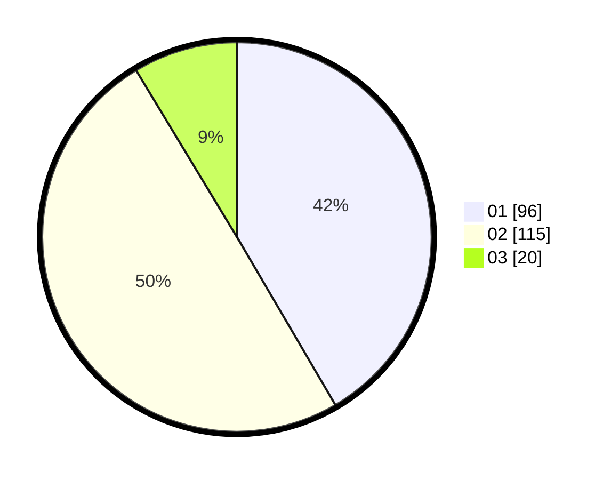

# Hasil

Hasil perolehan suara paslon dapat dilihat pada file paslon-01.txt, paslon-02.txt, dan paslon-03.txt.

Jika tidak ada, artinya data tersebut belum ada pada SIREKAP.

## Perolehan Suara

 * Paslon 01: **96**.
 * Paslon 02: **115**.
 * Paslon 03: **20**.

## Foto C Plano

https://sirekap-obj-formc.kpu.go.id/4fbe/pemilu/ppwp/31/72/02/10/03/3172021003034-20240214-201544--0fc4c25f-0692-455a-9ac8-2edba84325bb.jpg

https://sirekap-obj-formc.kpu.go.id/4fbe/pemilu/ppwp/31/72/02/10/03/3172021003034-20240214-201629--0f1b8bcd-7535-4e29-9ca6-84fee09d2412.jpg

https://sirekap-obj-formc.kpu.go.id/4fbe/pemilu/ppwp/31/72/02/10/03/3172021003034-20240214-201722--3efe6371-a988-40c4-9b89-4e6bfd9ef217.jpg

## DATA PEMILIH TETAP

Jumlah pemilih dalam DPT: **222**.
 * L: **110**.
 * P: **112**.

## DATA PENGGUNA HAK PILIH

Jumlah pengguna hak pilih dalam DPT: **222**.
 * L: **110**.
 * P: **112**.

Jumlah pengguna hak pilih dalam DPTb: **12**.
 * L: **9**.
 * P: **3**.

Jumlah pengguna hak pilih dalam DPK: **1**.
 * L: **1**.
 * P: **0**.

Jumlah pengguna hak pilih: **235**.
 * L: **120**.
 * P: **115**.

## JUMLAH SUARA SAH DAN TIDAK SAH

JUMLAH SELURUH SUARA SAH: **231**.

JUMLAH SUARA TIDAK SAH: **4**.

JUMLAH SELURUH SUARA SAH DAN SUARA TIDAK SAH: **235**.
