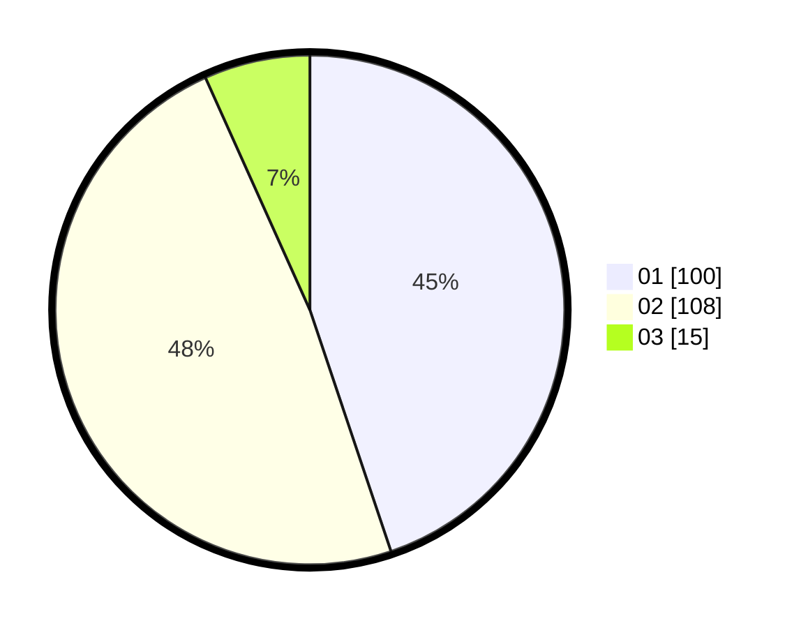

# Hasil

Hasil perolehan suara paslon dapat dilihat pada file paslon-01.txt, paslon-02.txt, dan paslon-03.txt.

Jika tidak ada, artinya data tersebut belum ada pada SIREKAP.

## Perolehan Suara

 * Paslon 01: **100**.
 * Paslon 02: **108**.
 * Paslon 03: **15**.

## Foto C Plano

https://sirekap-obj-formc.kpu.go.id/4585/pemilu/ppwp/31/72/02/10/03/3172021003061-20240215-020020--72563030-4ff9-4954-b730-1d6271454df8.jpg

https://sirekap-obj-formc.kpu.go.id/4585/pemilu/ppwp/31/72/02/10/03/3172021003061-20240215-020145--b41f5a3e-fa04-4108-9226-804f9b330714.jpg

https://sirekap-obj-formc.kpu.go.id/4585/pemilu/ppwp/31/72/02/10/03/3172021003061-20240215-020324--5d44255d-a573-4665-8516-c89e83fc97a5.jpg

## DATA PEMILIH TETAP

Jumlah pemilih dalam DPT: **288**.
 * L: **148**.
 * P: **140**.

## DATA PENGGUNA HAK PILIH

Jumlah pengguna hak pilih dalam DPT: **226**.
 * L: **116**.
 * P: **110**.

Jumlah pengguna hak pilih dalam DPTb: **0**.
 * L: **0**.
 * P: **0**.

Jumlah pengguna hak pilih dalam DPK: **0**.
 * L: **0**.
 * P: **0**.

Jumlah pengguna hak pilih: **226**.
 * L: **116**.
 * P: **110**.

## JUMLAH SUARA SAH DAN TIDAK SAH

JUMLAH SELURUH SUARA SAH: **223**.

JUMLAH SUARA TIDAK SAH: **3**.

JUMLAH SELURUH SUARA SAH DAN SUARA TIDAK SAH: **226**.
