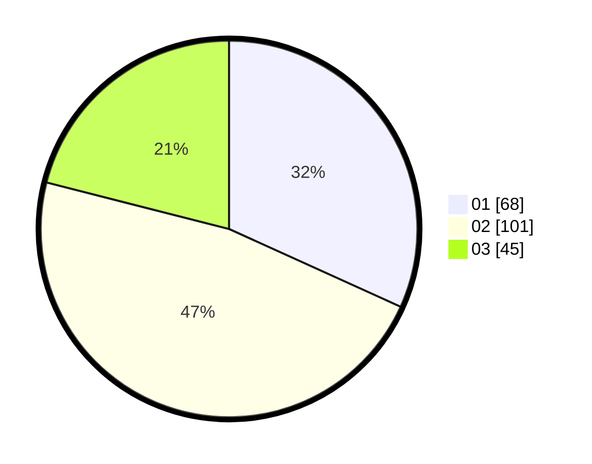

# Hasil

Hasil perolehan suara paslon dapat dilihat pada file paslon-01.txt, paslon-02.txt, dan paslon-03.txt.

Jika tidak ada, artinya data tersebut belum ada pada SIREKAP.

## Perolehan Suara

 * Paslon 01: **68**.
 * Paslon 02: **101**.
 * Paslon 03: **45**.

## Foto C Plano

https://sirekap-obj-formc.kpu.go.id/ab29/pemilu/ppwp/31/72/02/10/03/3172021003067-20240214-155044--1ec89d6f-3662-4a01-afc2-ed2f579a2036.jpg

https://sirekap-obj-formc.kpu.go.id/ab29/pemilu/ppwp/31/72/02/10/03/3172021003067-20240214-155024--c5c71819-5fd5-469a-83e9-9e1363648b3b.jpg

https://sirekap-obj-formc.kpu.go.id/ab29/pemilu/ppwp/31/72/02/10/03/3172021003067-20240214-160123--4a5e38ca-b3d4-40c5-a1bf-c6654b75097c.jpg

## DATA PEMILIH TETAP

Jumlah pemilih dalam DPT: **218**.
 * L: **100**.
 * P: **118**.

## DATA PENGGUNA HAK PILIH

Jumlah pengguna hak pilih dalam DPT: **218**.
 * L: **100**.
 * P: **118**.

Jumlah pengguna hak pilih dalam DPTb: **1**.
 * L: **1**.
 * P: **0**.

Jumlah pengguna hak pilih dalam DPK: **0**.
 * L: **0**.
 * P: **0**.

Jumlah pengguna hak pilih: **219**.
 * L: **101**.
 * P: **118**.

## JUMLAH SUARA SAH DAN TIDAK SAH

JUMLAH SELURUH SUARA SAH: **214**.

JUMLAH SUARA TIDAK SAH: **5**.

JUMLAH SELURUH SUARA SAH DAN SUARA TIDAK SAH: **219**.
