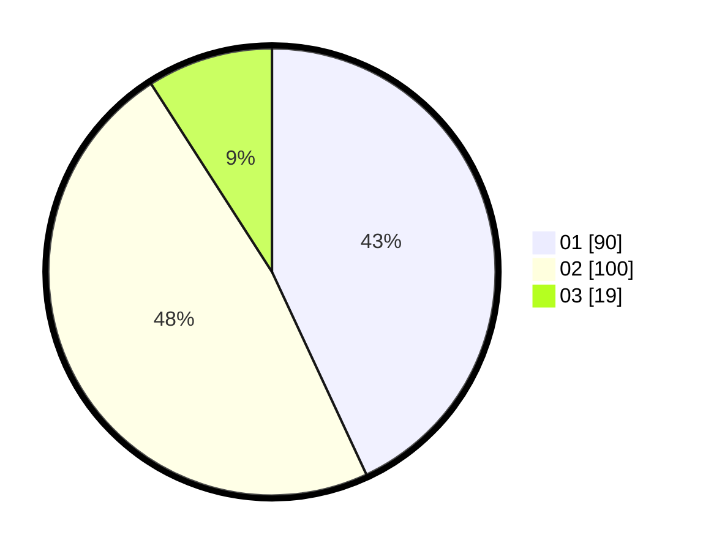

# Hasil

Hasil perolehan suara paslon dapat dilihat pada file paslon-01.txt, paslon-02.txt, dan paslon-03.txt.

Jika tidak ada, artinya data tersebut belum ada pada SIREKAP.

## Perolehan Suara

 * Paslon 01: **90**.
 * Paslon 02: **100**.
 * Paslon 03: **19**.

## Foto C Plano

https://sirekap-obj-formc.kpu.go.id/016e/pemilu/ppwp/31/72/02/10/03/3172021003070-20240214-202633--94af177a-418c-4a6b-a706-2b267f6711f2.jpg

https://sirekap-obj-formc.kpu.go.id/016e/pemilu/ppwp/31/72/02/10/03/3172021003070-20240214-202716--fb53fd07-28b9-4864-ae71-4714b88fe4d7.jpg

https://sirekap-obj-formc.kpu.go.id/016e/pemilu/ppwp/31/72/02/10/03/3172021003070-20240214-202816--577ac72e-2a1a-494d-a4f7-0d21e838d6f9.jpg

## DATA PEMILIH TETAP

Jumlah pemilih dalam DPT: **285**.
 * L: **141**.
 * P: **144**.

## DATA PENGGUNA HAK PILIH

Jumlah pengguna hak pilih dalam DPT: **209**.
 * L: **99**.
 * P: **110**.

Jumlah pengguna hak pilih dalam DPTb: **0**.
 * L: **0**.
 * P: **0**.

Jumlah pengguna hak pilih dalam DPK: **1**.
 * L: **0**.
 * P: **1**.

Jumlah pengguna hak pilih: **210**.
 * L: **99**.
 * P: **111**.

## JUMLAH SUARA SAH DAN TIDAK SAH

JUMLAH SELURUH SUARA SAH: **209**.

JUMLAH SUARA TIDAK SAH: **1**.

JUMLAH SELURUH SUARA SAH DAN SUARA TIDAK SAH: **210**.
