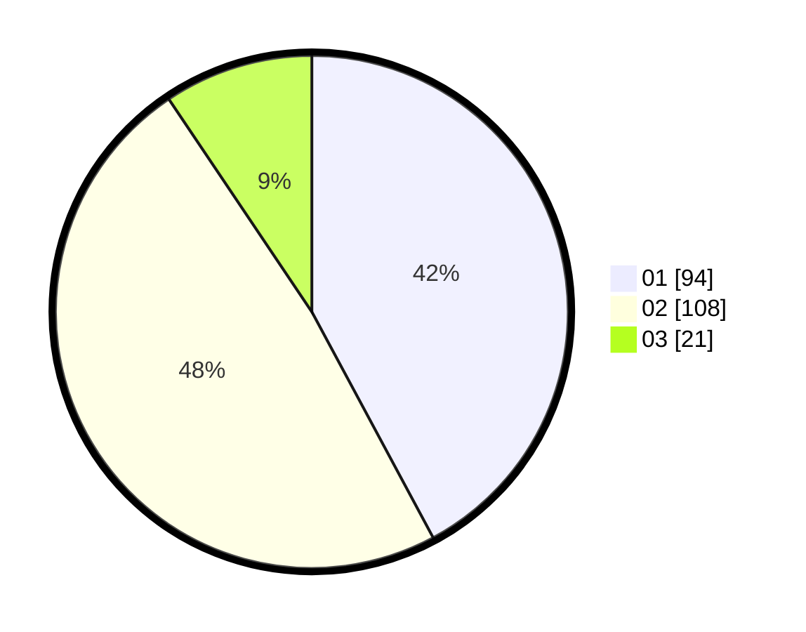

# Hasil

Hasil perolehan suara paslon dapat dilihat pada file paslon-01.txt, paslon-02.txt, dan paslon-03.txt.

Jika tidak ada, artinya data tersebut belum ada pada SIREKAP.

## Perolehan Suara

 * Paslon 01: **94**.
 * Paslon 02: **108**.
 * Paslon 03: **21**.

## Foto C Plano

https://sirekap-obj-formc.kpu.go.id/e8d3/pemilu/ppwp/31/72/02/10/03/3172021003071-20240214-211721--4e91ccff-dee3-4849-83e6-2cdc5049cba6.jpg

https://sirekap-obj-formc.kpu.go.id/e8d3/pemilu/ppwp/31/72/02/10/03/3172021003071-20240214-211734--0a6062f1-af91-4cd4-89db-b8c3362ea366.jpg

https://sirekap-obj-formc.kpu.go.id/e8d3/pemilu/ppwp/31/72/02/10/03/3172021003071-20240214-211742--5327404e-c3ef-4d17-b14e-f9652d4220c1.jpg

## DATA PEMILIH TETAP

Jumlah pemilih dalam DPT: **283**.
 * L: **145**.
 * P: **138**.

## DATA PENGGUNA HAK PILIH

Jumlah pengguna hak pilih dalam DPT: **223**.
 * L: **107**.
 * P: **116**.

Jumlah pengguna hak pilih dalam DPTb: **1**.
 * L: **0**.
 * P: **1**.

Jumlah pengguna hak pilih dalam DPK: **4**.
 * L: **1**.
 * P: **3**.

Jumlah pengguna hak pilih: **228**.
 * L: **108**.
 * P: **120**.

## JUMLAH SUARA SAH DAN TIDAK SAH

JUMLAH SELURUH SUARA SAH: **223**.

JUMLAH SUARA TIDAK SAH: **5**.

JUMLAH SELURUH SUARA SAH DAN SUARA TIDAK SAH: **228**.
