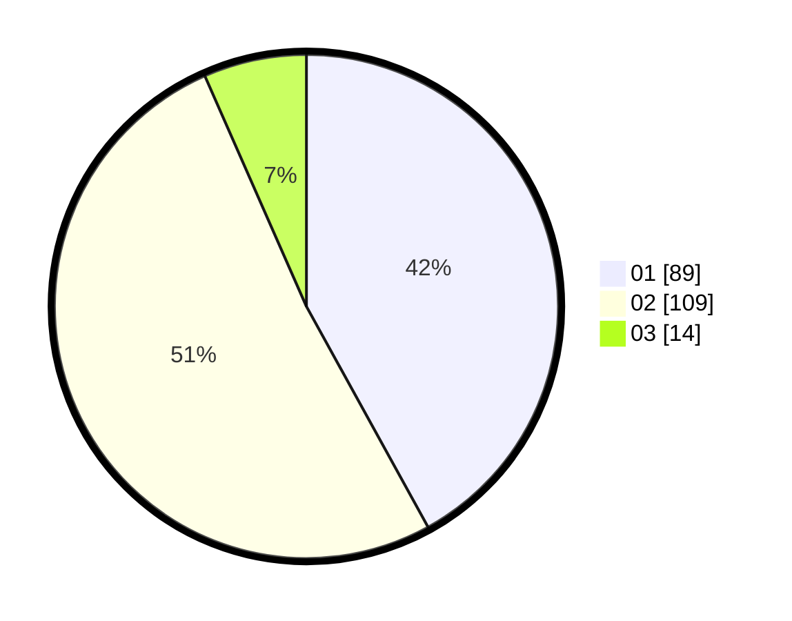

# Hasil

Hasil perolehan suara paslon dapat dilihat pada file paslon-01.txt, paslon-02.txt, dan paslon-03.txt.

Jika tidak ada, artinya data tersebut belum ada pada SIREKAP.

## Perolehan Suara

 * Paslon 01: **89**.
 * Paslon 02: **109**.
 * Paslon 03: **14**.

## Foto C Plano

https://sirekap-obj-formc.kpu.go.id/b06c/pemilu/ppwp/31/72/02/10/03/3172021003076-20240214-155336--323eb61f-456e-4df8-b8f1-b95ea5eb31dc.jpg

https://sirekap-obj-formc.kpu.go.id/b06c/pemilu/ppwp/31/72/02/10/03/3172021003076-20240214-155434--f58d1fec-282a-4d2e-914a-45c0597917c7.jpg

https://sirekap-obj-formc.kpu.go.id/b06c/pemilu/ppwp/31/72/02/10/03/3172021003076-20240214-155749--91603fe9-c359-4400-b729-b7ba748b29b0.jpg

## DATA PEMILIH TETAP

Jumlah pemilih dalam DPT: **284**.
 * L: **142**.
 * P: **142**.

## DATA PENGGUNA HAK PILIH

Jumlah pengguna hak pilih dalam DPT: **206**.
 * L: **96**.
 * P: **110**.

Jumlah pengguna hak pilih dalam DPTb: **1**.
 * L: **1**.
 * P: **0**.

Jumlah pengguna hak pilih dalam DPK: **7**.
 * L: **4**.
 * P: **3**.

Jumlah pengguna hak pilih: **214**.
 * L: **101**.
 * P: **113**.

## JUMLAH SUARA SAH DAN TIDAK SAH

JUMLAH SELURUH SUARA SAH: **212**.

JUMLAH SUARA TIDAK SAH: **2**.

JUMLAH SELURUH SUARA SAH DAN SUARA TIDAK SAH: **214**.
