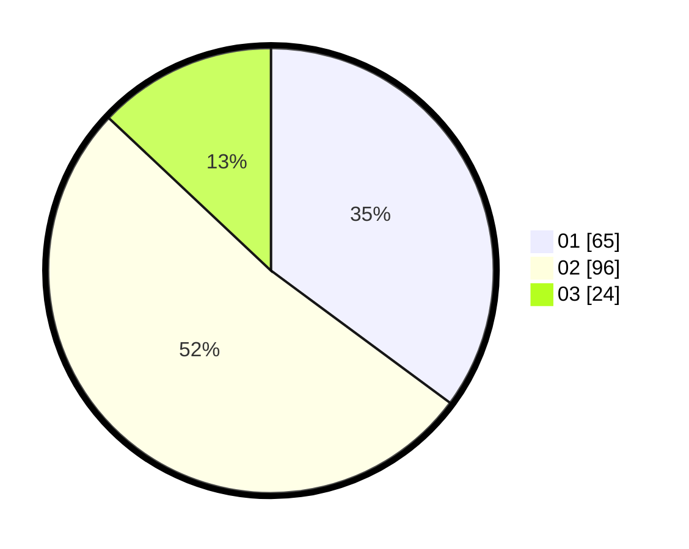

# Hasil

Hasil perolehan suara paslon dapat dilihat pada file paslon-01.txt, paslon-02.txt, dan paslon-03.txt.

Jika tidak ada, artinya data tersebut belum ada pada SIREKAP.

## Perolehan Suara

 * Paslon 01: **65**.
 * Paslon 02: **96**.
 * Paslon 03: **24**.

## Foto C Plano

https://sirekap-obj-formc.kpu.go.id/4686/pemilu/ppwp/31/72/02/10/03/3172021003077-20240214-201548--77ecf1c8-821f-41a3-95e1-28926dbf280a.jpg

https://sirekap-obj-formc.kpu.go.id/4686/pemilu/ppwp/31/72/02/10/03/3172021003077-20240214-202112--9779fbd9-2a7a-4bf4-88e8-58f5c617c17e.jpg
