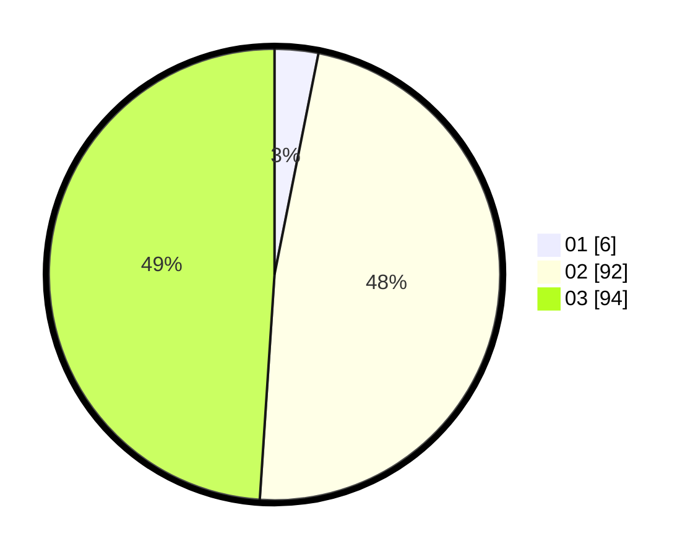

# Hasil

Hasil perolehan suara paslon dapat dilihat pada file paslon-01.txt, paslon-02.txt, dan paslon-03.txt.

Jika tidak ada, artinya data tersebut belum ada pada SIREKAP.

## Perolehan Suara

 * Paslon 01: **6**.
 * Paslon 02: **92**.
 * Paslon 03: **94**.

## Foto C Plano

https://sirekap-obj-formc.kpu.go.id/7b62/pemilu/ppwp/31/72/02/10/03/3172021003080-20240214-224525--283f047c-3886-4d90-ac55-fcbc01e6e6d1.jpg

https://sirekap-obj-formc.kpu.go.id/7b62/pemilu/ppwp/31/72/02/10/03/3172021003080-20240214-162230--8f86ff82-8cc6-4330-be75-8be4ce71d8f9.jpg

https://sirekap-obj-formc.kpu.go.id/7b62/pemilu/ppwp/31/72/02/10/03/3172021003080-20240214-213830--9efdd9d1-384d-490f-9d38-5a1df8041358.jpg

## DATA PEMILIH TETAP

Jumlah pemilih dalam DPT: **226**.
 * L: **111**.
 * P: **115**.

## DATA PENGGUNA HAK PILIH

Jumlah pengguna hak pilih dalam DPT: **191**.
 * L: **94**.
 * P: **97**.

Jumlah pengguna hak pilih dalam DPTb: **2**.
 * L: **0**.
 * P: **2**.

Jumlah pengguna hak pilih dalam DPK: **0**.
 * L: **0**.
 * P: **0**.

Jumlah pengguna hak pilih: **193**.
 * L: **94**.
 * P: **99**.

## JUMLAH SUARA SAH DAN TIDAK SAH

JUMLAH SELURUH SUARA SAH: **192**.

JUMLAH SUARA TIDAK SAH: **1**.

JUMLAH SELURUH SUARA SAH DAN SUARA TIDAK SAH: **193**.
