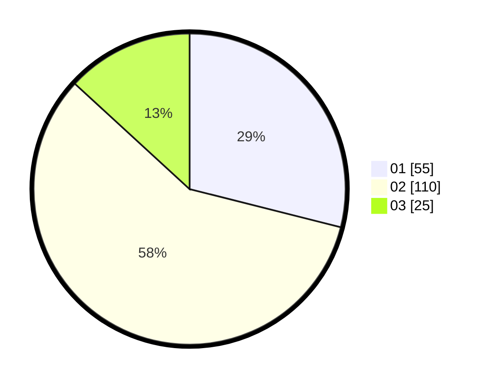

# Hasil

Hasil perolehan suara paslon dapat dilihat pada file paslon-01.txt, paslon-02.txt, dan paslon-03.txt.

Jika tidak ada, artinya data tersebut belum ada pada SIREKAP.

## Perolehan Suara

 * Paslon 01: **55**.
 * Paslon 02: **110**.
 * Paslon 03: **25**.

## Foto C Plano

https://sirekap-obj-formc.kpu.go.id/a7d1/pemilu/ppwp/31/72/02/10/03/3172021003085-20240215-205324--fcc8e8dc-c975-4582-852f-991287edc9b2.jpg

https://sirekap-obj-formc.kpu.go.id/a7d1/pemilu/ppwp/31/72/02/10/03/3172021003085-20240215-205326--1a9723e3-17e5-418d-a47f-2f37d570f97a.jpg

https://sirekap-obj-formc.kpu.go.id/a7d1/pemilu/ppwp/31/72/02/10/03/3172021003085-20240215-205325--1f85d29f-818e-47dd-923f-ab77ba586f60.jpg

## DATA PEMILIH TETAP

Jumlah pemilih dalam DPT: **195**.
 * L: **101**.
 * P: **94**.

## DATA PENGGUNA HAK PILIH

Jumlah pengguna hak pilih dalam DPT: **195**.
 * L: **101**.
 * P: **94**.

Jumlah pengguna hak pilih dalam DPTb: **1**.
 * L: **0**.
 * P: **1**.

Jumlah pengguna hak pilih dalam DPK: **1**.
 * L: **0**.
 * P: **1**.

Jumlah pengguna hak pilih: **197**.
 * L: **101**.
 * P: **96**.

## JUMLAH SUARA SAH DAN TIDAK SAH

JUMLAH SELURUH SUARA SAH: **190**.

JUMLAH SUARA TIDAK SAH: **7**.

JUMLAH SELURUH SUARA SAH DAN SUARA TIDAK SAH: **197**.
