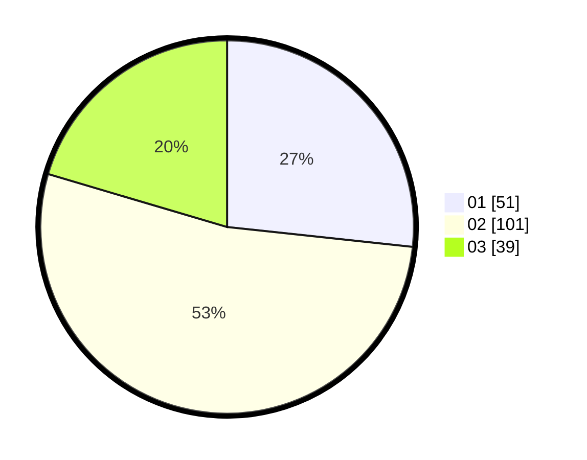

# Hasil

Hasil perolehan suara paslon dapat dilihat pada file paslon-01.txt, paslon-02.txt, dan paslon-03.txt.

Jika tidak ada, artinya data tersebut belum ada pada SIREKAP.

## Perolehan Suara

 * Paslon 01: **51**.
 * Paslon 02: **101**.
 * Paslon 03: **39**.

## Foto C Plano

https://sirekap-obj-formc.kpu.go.id/4655/pemilu/ppwp/31/72/02/10/03/3172021003098-20240214-214011--ff872747-6cb1-4dcb-acd7-f17886066960.jpg

https://sirekap-obj-formc.kpu.go.id/4655/pemilu/ppwp/31/72/02/10/03/3172021003098-20240214-214118--6d628a67-d27d-47fe-bc83-f9ef5678f7ae.jpg

https://sirekap-obj-formc.kpu.go.id/4655/pemilu/ppwp/31/72/02/10/03/3172021003098-20240214-214222--3d413089-37fa-43bc-8146-8cd42a08f2ec.jpg

## DATA PEMILIH TETAP

Jumlah pemilih dalam DPT: **286**.
 * L: **101**.
 * P: **125**.

## DATA PENGGUNA HAK PILIH

Jumlah pengguna hak pilih dalam DPT: **195**.
 * L: **103**.
 * P: **92**.

Jumlah pengguna hak pilih dalam DPTb: **0**.
 * L: **0**.
 * P: **0**.

Jumlah pengguna hak pilih dalam DPK: **0**.
 * L: **0**.
 * P: **0**.

Jumlah pengguna hak pilih: **195**.
 * L: **103**.
 * P: **92**.

## JUMLAH SUARA SAH DAN TIDAK SAH

JUMLAH SELURUH SUARA SAH: **191**.

JUMLAH SUARA TIDAK SAH: **4**.

JUMLAH SELURUH SUARA SAH DAN SUARA TIDAK SAH: **195**.
