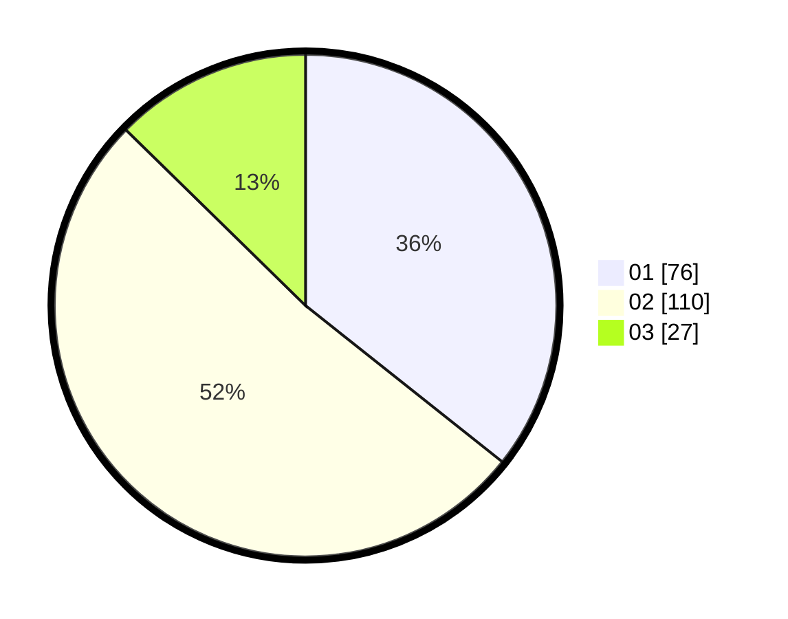

# Hasil

Hasil perolehan suara paslon dapat dilihat pada file paslon-01.txt, paslon-02.txt, dan paslon-03.txt.

Jika tidak ada, artinya data tersebut belum ada pada SIREKAP.

## Perolehan Suara

 * Paslon 01: **76**.
 * Paslon 02: **110**.
 * Paslon 03: **27**.

## Foto C Plano

https://sirekap-obj-formc.kpu.go.id/6dd1/pemilu/ppwp/31/72/02/10/03/3172021003107-20240216-141417--cc8e0baf-86a5-49c2-b6a4-4e7b009c8122.jpg

https://sirekap-obj-formc.kpu.go.id/6dd1/pemilu/ppwp/31/72/02/10/03/3172021003107-20240214-195403--68d03f6b-c9df-4975-82d9-9d80446c7cee.jpg

https://sirekap-obj-formc.kpu.go.id/6dd1/pemilu/ppwp/31/72/02/10/03/3172021003107-20240214-202847--017e74cd-928c-44ca-a8b1-9b071eef5c9e.jpg

## DATA PEMILIH TETAP

Jumlah pemilih dalam DPT: **0**.
 * L: **0**.
 * P: **0**.

## DATA PENGGUNA HAK PILIH

Jumlah pengguna hak pilih dalam DPT: **0**.
 * L: **0**.
 * P: **0**.

Jumlah pengguna hak pilih dalam DPTb: **0**.
 * L: **0**.
 * P: **0**.

Jumlah pengguna hak pilih dalam DPK: **0**.
 * L: **0**.
 * P: **0**.

Jumlah pengguna hak pilih: **0**.
 * L: **0**.
 * P: **0**.

## JUMLAH SUARA SAH DAN TIDAK SAH

JUMLAH SELURUH SUARA SAH: **213**.

JUMLAH SUARA TIDAK SAH: **4**.

JUMLAH SELURUH SUARA SAH DAN SUARA TIDAK SAH: **217**.
