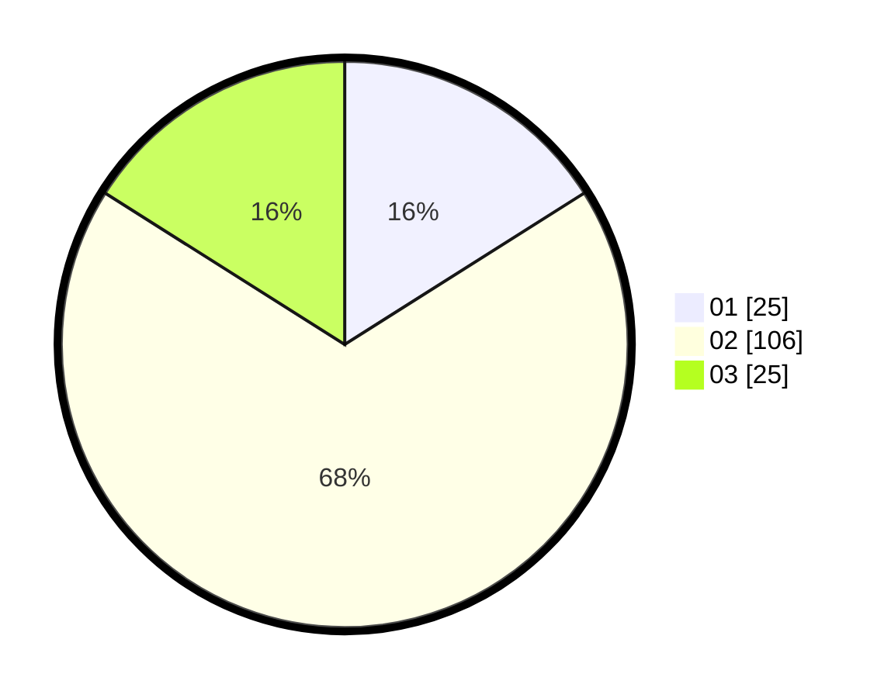

# Hasil

Hasil perolehan suara paslon dapat dilihat pada file paslon-01.txt, paslon-02.txt, dan paslon-03.txt.

Jika tidak ada, artinya data tersebut belum ada pada SIREKAP.

## Perolehan Suara

 * Paslon 01: **25**.
 * Paslon 02: **106**.
 * Paslon 03: **25**.

## Foto C Plano

https://sirekap-obj-formc.kpu.go.id/d5e3/pemilu/ppwp/31/72/02/10/03/3172021003114-20240215-002028--e4aab0d6-512e-467d-9fd1-b2cbdbc54805.jpg

https://sirekap-obj-formc.kpu.go.id/d5e3/pemilu/ppwp/31/72/02/10/03/3172021003114-20240215-002037--0b6a3244-7335-49ba-8e76-758c053d23c4.jpg

https://sirekap-obj-formc.kpu.go.id/d5e3/pemilu/ppwp/31/72/02/10/03/3172021003114-20240215-002046--250652ef-c148-4c43-a498-a9ffb6efcb11.jpg
