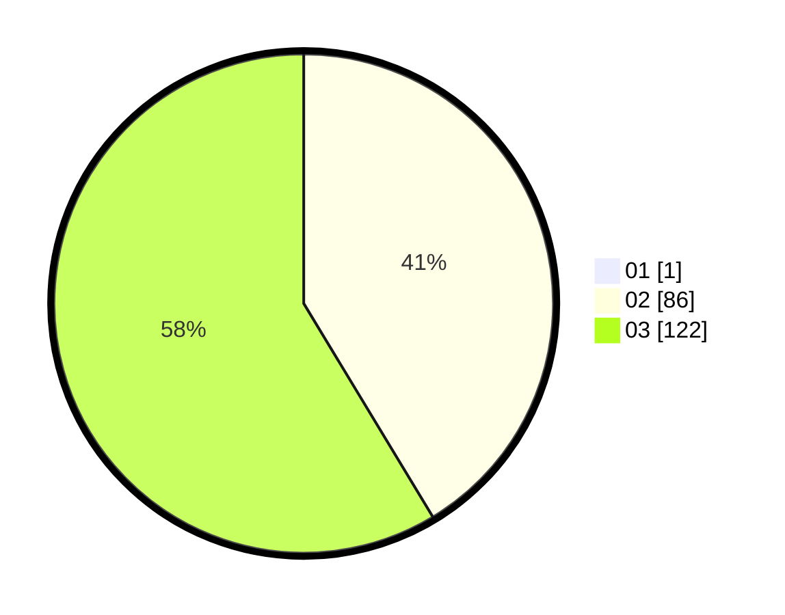

# Hasil

Hasil perolehan suara paslon dapat dilihat pada file paslon-01.txt, paslon-02.txt, dan paslon-03.txt.

Jika tidak ada, artinya data tersebut belum ada pada SIREKAP.

## Perolehan Suara

 * Paslon 01: **1**.
 * Paslon 02: **86**.
 * Paslon 03: **122**.

## Foto C Plano

https://sirekap-obj-formc.kpu.go.id/aa1e/pemilu/ppwp/31/72/02/10/03/3172021003119-20240214-155856--a3b282d5-964d-4488-8b8d-b5cb98ecebca.jpg

https://sirekap-obj-formc.kpu.go.id/aa1e/pemilu/ppwp/31/72/02/10/03/3172021003119-20240214-155739--91670b32-205f-47a2-8d84-dd6b2d514439.jpg

https://sirekap-obj-formc.kpu.go.id/aa1e/pemilu/ppwp/31/72/02/10/03/3172021003119-20240214-160148--af73a0db-90c2-406d-b69d-286b6df3f155.jpg

## DATA PEMILIH TETAP

Jumlah pemilih dalam DPT: **271**.
 * L: **128**.
 * P: **143**.

## DATA PENGGUNA HAK PILIH

Jumlah pengguna hak pilih dalam DPT: **191**.
 * L: **92**.
 * P: **99**.

Jumlah pengguna hak pilih dalam DPTb: **15**.
 * L: **6**.
 * P: **9**.

Jumlah pengguna hak pilih dalam DPK: **4**.
 * L: **2**.
 * P: **2**.

Jumlah pengguna hak pilih: **210**.
 * L: **100**.
 * P: **110**.

## JUMLAH SUARA SAH DAN TIDAK SAH

JUMLAH SELURUH SUARA SAH: **209**.

JUMLAH SUARA TIDAK SAH: **1**.

JUMLAH SELURUH SUARA SAH DAN SUARA TIDAK SAH: **210**.
