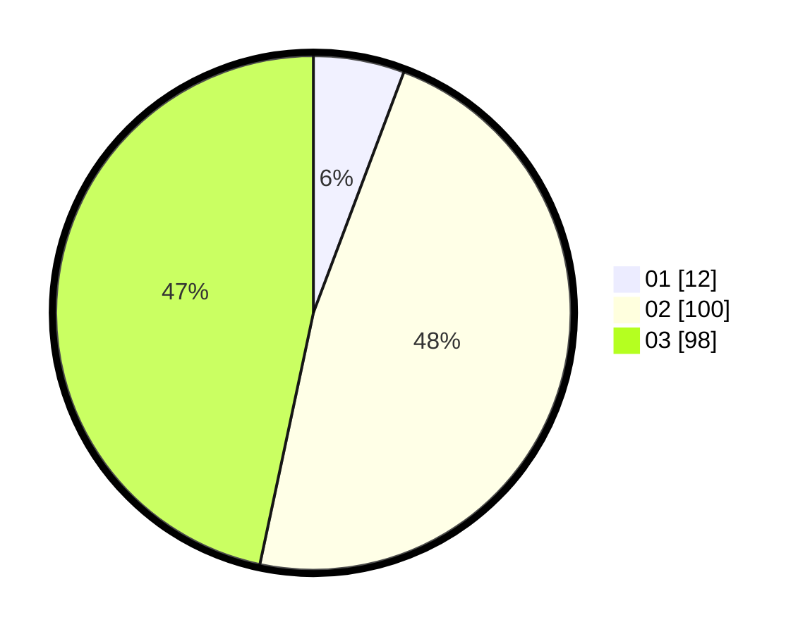

# Hasil

Hasil perolehan suara paslon dapat dilihat pada file paslon-01.txt, paslon-02.txt, dan paslon-03.txt.

Jika tidak ada, artinya data tersebut belum ada pada SIREKAP.

## Perolehan Suara

 * Paslon 01: **12**.
 * Paslon 02: **100**.
 * Paslon 03: **98**.

## Foto C Plano

https://sirekap-obj-formc.kpu.go.id/bd5d/pemilu/ppwp/31/72/02/10/03/3172021003126-20240216-114243--7b0dfda6-b4dd-442b-8fb1-bcde6751e857.jpg

https://sirekap-obj-formc.kpu.go.id/bd5d/pemilu/ppwp/31/72/02/10/03/3172021003126-20240216-113229--e7170c9b-dd13-4b7f-8604-98c04519df4e.jpg

https://sirekap-obj-formc.kpu.go.id/bd5d/pemilu/ppwp/31/72/02/10/03/3172021003126-20240216-113716--c373eec9-c106-4a2f-a875-b8cda11fc3ed.jpg

## DATA PEMILIH TETAP

Jumlah pemilih dalam DPT: **260**.
 * L: **135**.
 * P: **125**.

## DATA PENGGUNA HAK PILIH

Jumlah pengguna hak pilih dalam DPT: **186**.
 * L: **96**.
 * P: **90**.

Jumlah pengguna hak pilih dalam DPTb: **6**.
 * L: **2**.
 * P: **4**.

Jumlah pengguna hak pilih dalam DPK: **19**.
 * L: **7**.
 * P: **12**.

Jumlah pengguna hak pilih: **211**.
 * L: **105**.
 * P: **106**.

## JUMLAH SUARA SAH DAN TIDAK SAH

JUMLAH SELURUH SUARA SAH: **210**.

JUMLAH SUARA TIDAK SAH: **1**.

JUMLAH SELURUH SUARA SAH DAN SUARA TIDAK SAH: **211**.
