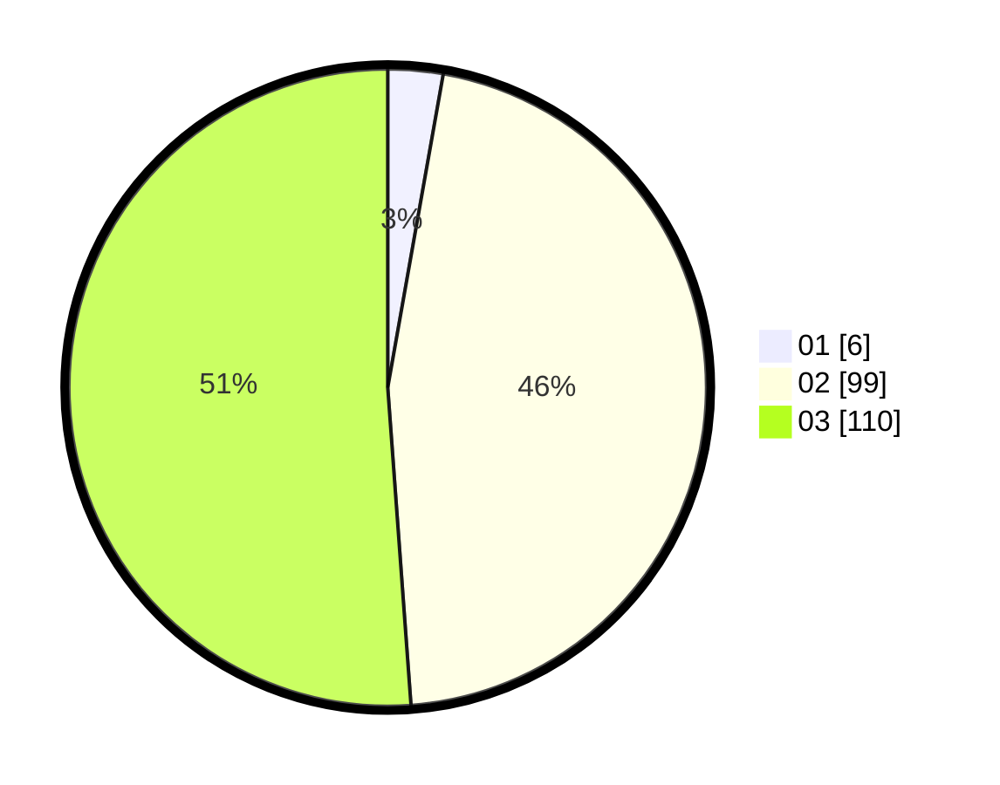

# Hasil

Hasil perolehan suara paslon dapat dilihat pada file paslon-01.txt, paslon-02.txt, dan paslon-03.txt.

Jika tidak ada, artinya data tersebut belum ada pada SIREKAP.

## Perolehan Suara

 * Paslon 01: **6**.
 * Paslon 02: **99**.
 * Paslon 03: **110**.

## Foto C Plano

https://sirekap-obj-formc.kpu.go.id/8537/pemilu/ppwp/31/72/02/10/03/3172021003127-20240214-213604--afb63be8-9013-4203-b290-c0d85cbd64da.jpg

https://sirekap-obj-formc.kpu.go.id/8537/pemilu/ppwp/31/72/02/10/03/3172021003127-20240214-213629--407827a3-fe6c-4fa4-8a76-a8862694773a.jpg

https://sirekap-obj-formc.kpu.go.id/8537/pemilu/ppwp/31/72/02/10/03/3172021003127-20240214-213701--089dcf13-c29c-4019-a2bb-5cec847837a6.jpg

## DATA PEMILIH TETAP

Jumlah pemilih dalam DPT: **236**.
 * L: **110**.
 * P: **126**.

## DATA PENGGUNA HAK PILIH

Jumlah pengguna hak pilih dalam DPT: **182**.
 * L: **89**.
 * P: **93**.

Jumlah pengguna hak pilih dalam DPTb: **21**.
 * L: **8**.
 * P: **13**.

Jumlah pengguna hak pilih dalam DPK: **12**.
 * L: **5**.
 * P: **7**.

Jumlah pengguna hak pilih: **215**.
 * L: **102**.
 * P: **113**.

## JUMLAH SUARA SAH DAN TIDAK SAH

JUMLAH SELURUH SUARA SAH: **215**.

JUMLAH SUARA TIDAK SAH: **0**.

JUMLAH SELURUH SUARA SAH DAN SUARA TIDAK SAH: **215**.
