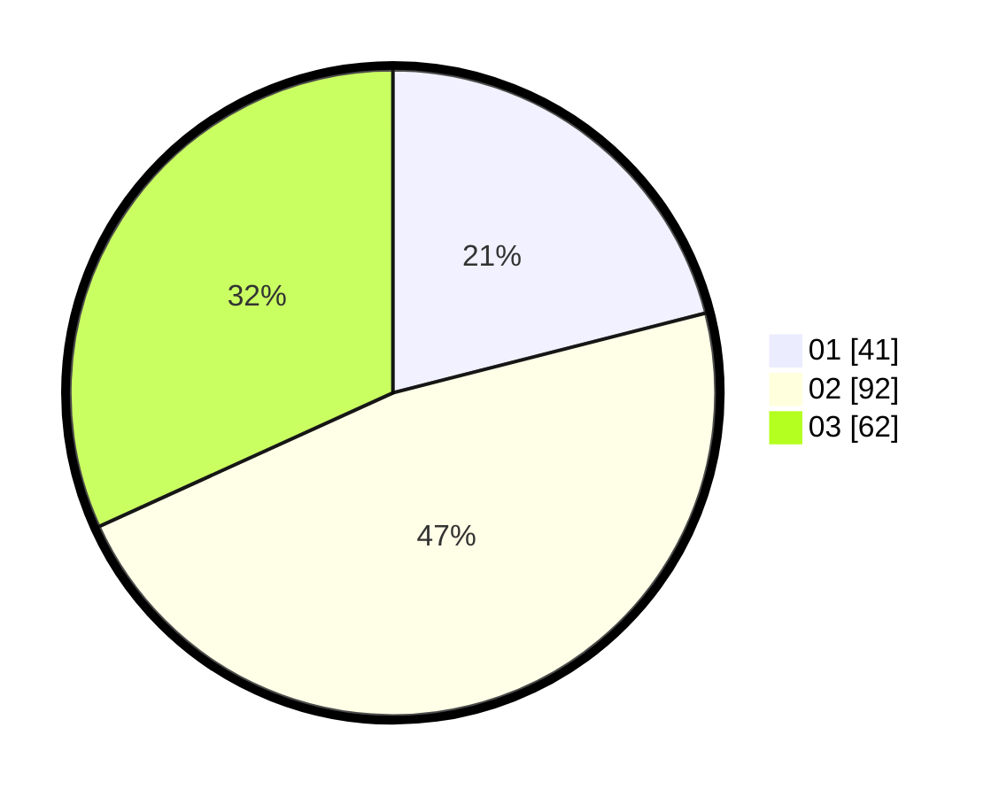

# Hasil

Hasil perolehan suara paslon dapat dilihat pada file paslon-01.txt, paslon-02.txt, dan paslon-03.txt.

Jika tidak ada, artinya data tersebut belum ada pada SIREKAP.

## Perolehan Suara

 * Paslon 01: **41**.
 * Paslon 02: **92**.
 * Paslon 03: **62**.

## Foto C Plano

https://sirekap-obj-formc.kpu.go.id/a70e/pemilu/ppwp/31/72/02/10/04/3172021004001-20240215-015531--3a95f00f-a01f-4c10-abd4-1f32d0baf4c0.jpg

https://sirekap-obj-formc.kpu.go.id/a70e/pemilu/ppwp/31/72/02/10/04/3172021004001-20240216-144604--eef21e38-3661-4903-a2e4-deaf26aa0f68.jpg

https://sirekap-obj-formc.kpu.go.id/a70e/pemilu/ppwp/31/72/02/10/04/3172021004001-20240215-015758--3949d3af-2aae-49dd-95da-db25a5b1380d.jpg

## DATA PEMILIH TETAP

Jumlah pemilih dalam DPT: **273**.
 * L: **130**.
 * P: **143**.

## DATA PENGGUNA HAK PILIH

Jumlah pengguna hak pilih dalam DPT: **191**.
 * L: **83**.
 * P: **108**.

Jumlah pengguna hak pilih dalam DPTb: **2**.
 * L: **2**.
 * P: **0**.

Jumlah pengguna hak pilih dalam DPK: **3**.
 * L: **0**.
 * P: **3**.

Jumlah pengguna hak pilih: **196**.
 * L: **85**.
 * P: **111**.

## JUMLAH SUARA SAH DAN TIDAK SAH

JUMLAH SELURUH SUARA SAH: **195**.

JUMLAH SUARA TIDAK SAH: **1**.

JUMLAH SELURUH SUARA SAH DAN SUARA TIDAK SAH: **196**.
