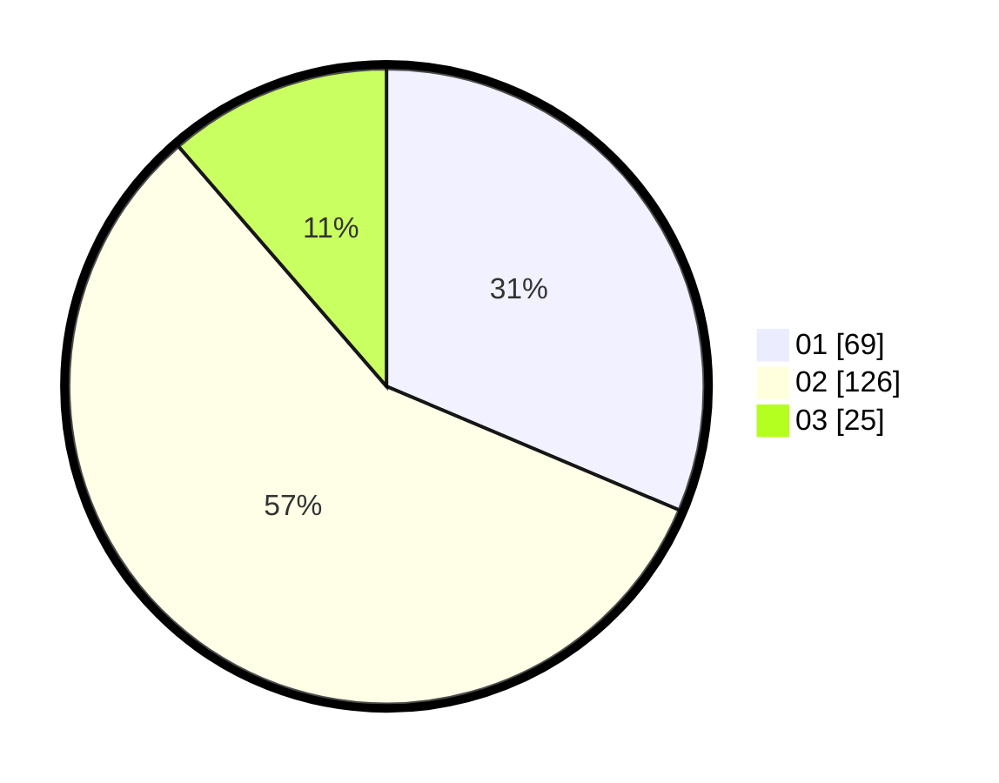

# Hasil

Hasil perolehan suara paslon dapat dilihat pada file paslon-01.txt, paslon-02.txt, dan paslon-03.txt.

Jika tidak ada, artinya data tersebut belum ada pada SIREKAP.

## Perolehan Suara

 * Paslon 01: **69**.
 * Paslon 02: **126**.
 * Paslon 03: **25**.

## Foto C Plano

https://sirekap-obj-formc.kpu.go.id/757b/pemilu/ppwp/31/72/02/10/04/3172021004005-20240216-145959--387fc1ad-2261-43ac-8219-b0502ef8146d.jpg

https://sirekap-obj-formc.kpu.go.id/757b/pemilu/ppwp/31/72/02/10/04/3172021004005-20240214-215705--427106dd-c158-4250-839d-cb9103abfb45.jpg

https://sirekap-obj-formc.kpu.go.id/757b/pemilu/ppwp/31/72/02/10/04/3172021004005-20240214-215904--da9a963b-4270-457b-8f96-5bb92e76fdf4.jpg

## DATA PEMILIH TETAP

Jumlah pemilih dalam DPT: **290**.
 * L: **139**.
 * P: **151**.

## DATA PENGGUNA HAK PILIH

Jumlah pengguna hak pilih dalam DPT: **220**.
 * L: **96**.
 * P: **124**.

Jumlah pengguna hak pilih dalam DPTb: **0**.
 * L: **0**.
 * P: **0**.

Jumlah pengguna hak pilih dalam DPK: **5**.
 * L: **1**.
 * P: **4**.

Jumlah pengguna hak pilih: **225**.
 * L: **97**.
 * P: **128**.

## JUMLAH SUARA SAH DAN TIDAK SAH

JUMLAH SELURUH SUARA SAH: **220**.

JUMLAH SUARA TIDAK SAH: **5**.

JUMLAH SELURUH SUARA SAH DAN SUARA TIDAK SAH: **225**.
