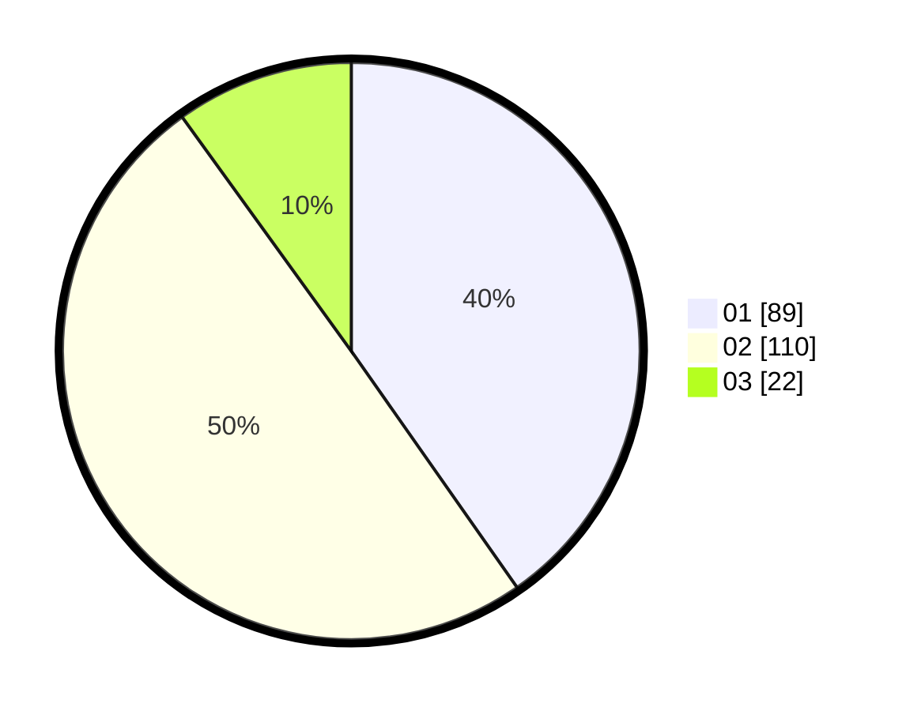

# Hasil

Hasil perolehan suara paslon dapat dilihat pada file paslon-01.txt, paslon-02.txt, dan paslon-03.txt.

Jika tidak ada, artinya data tersebut belum ada pada SIREKAP.

## Perolehan Suara

 * Paslon 01: **89**.
 * Paslon 02: **110**.
 * Paslon 03: **22**.

## Foto C Plano

https://sirekap-obj-formc.kpu.go.id/3b45/pemilu/ppwp/31/72/02/10/04/3172021004012-20240215-062229--477d83b1-b062-4be1-8384-71156740a532.jpg

https://sirekap-obj-formc.kpu.go.id/3b45/pemilu/ppwp/31/72/02/10/04/3172021004012-20240215-062838--81671e02-a76b-4b02-8825-5d90bcfa0c4a.jpg

https://sirekap-obj-formc.kpu.go.id/3b45/pemilu/ppwp/31/72/02/10/04/3172021004012-20240214-224859--bf9ee60c-cf24-4c17-979b-0c8b18ddabca.jpg

## DATA PEMILIH TETAP

Jumlah pemilih dalam DPT: **295**.
 * L: **151**.
 * P: **133**.

## DATA PENGGUNA HAK PILIH

Jumlah pengguna hak pilih dalam DPT: **218**.
 * L: **109**.
 * P: **109**.

Jumlah pengguna hak pilih dalam DPTb: **4**.
 * L: **3**.
 * P: **1**.

Jumlah pengguna hak pilih dalam DPK: **3**.
 * L: **2**.
 * P: **1**.

Jumlah pengguna hak pilih: **225**.
 * L: **114**.
 * P: **111**.

## JUMLAH SUARA SAH DAN TIDAK SAH

JUMLAH SELURUH SUARA SAH: **221**.

JUMLAH SUARA TIDAK SAH: **4**.

JUMLAH SELURUH SUARA SAH DAN SUARA TIDAK SAH: **225**.
