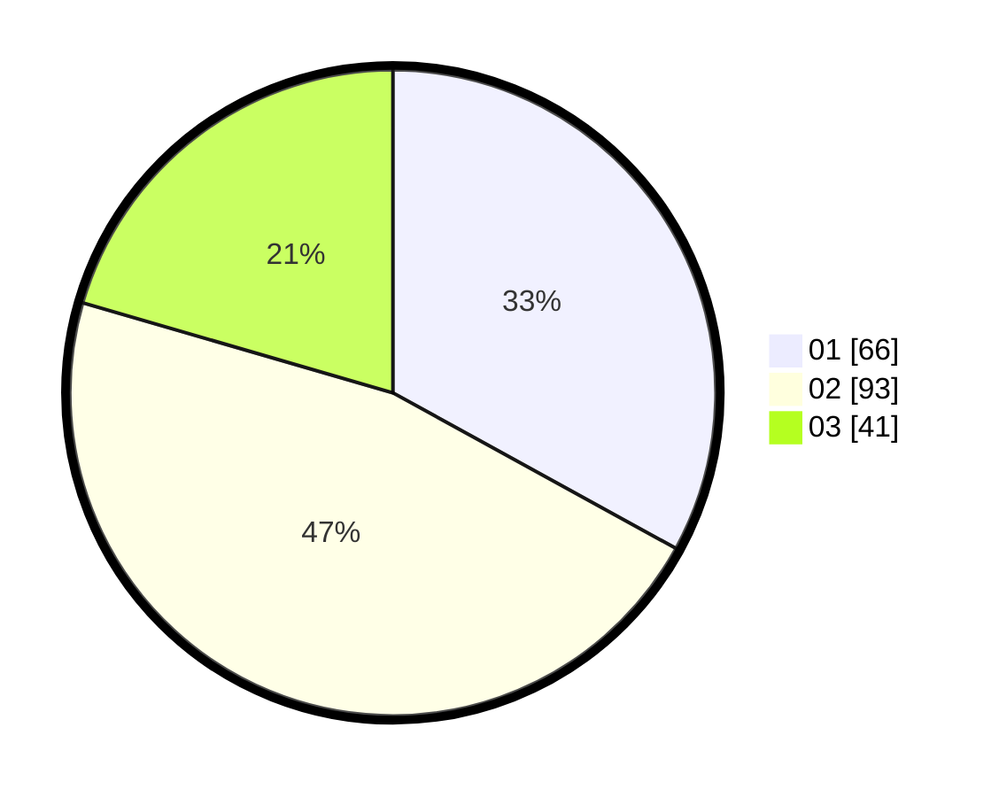

# Hasil

Hasil perolehan suara paslon dapat dilihat pada file paslon-01.txt, paslon-02.txt, dan paslon-03.txt.

Jika tidak ada, artinya data tersebut belum ada pada SIREKAP.

## Perolehan Suara

 * Paslon 01: **66**.
 * Paslon 02: **93**.
 * Paslon 03: **41**.

## Foto C Plano

https://sirekap-obj-formc.kpu.go.id/4e2a/pemilu/ppwp/31/72/02/10/04/3172021004018-20240214-234956--408286e8-89cd-4c33-bd7b-3a39fd54f8f5.jpg

https://sirekap-obj-formc.kpu.go.id/4e2a/pemilu/ppwp/31/72/02/10/04/3172021004018-20240214-160115--3c8695fd-07fe-4b33-b0e1-1d2fe7ad1807.jpg

https://sirekap-obj-formc.kpu.go.id/4e2a/pemilu/ppwp/31/72/02/10/04/3172021004018-20240214-160142--2f9b4f74-e3da-4749-bf47-b7d1c5525e69.jpg
