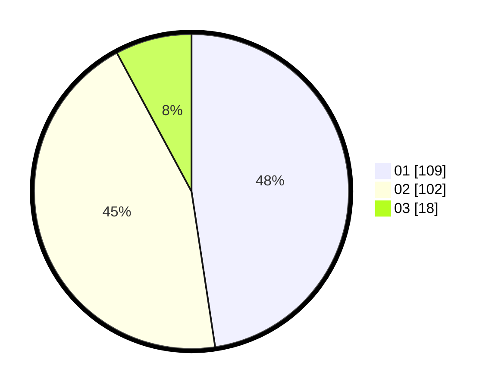

# Hasil

Hasil perolehan suara paslon dapat dilihat pada file paslon-01.txt, paslon-02.txt, dan paslon-03.txt.

Jika tidak ada, artinya data tersebut belum ada pada SIREKAP.

## Perolehan Suara

 * Paslon 01: **109**.
 * Paslon 02: **102**.
 * Paslon 03: **18**.

## Foto C Plano

https://sirekap-obj-formc.kpu.go.id/ec8c/pemilu/ppwp/31/72/02/10/04/3172021004026-20240215-072559--315b360c-a7ab-4c93-9692-4bcb2c54f324.jpg

https://sirekap-obj-formc.kpu.go.id/ec8c/pemilu/ppwp/31/72/02/10/04/3172021004026-20240215-072655--bb57bd9a-9b55-4a73-8578-e586bccbfdbc.jpg
