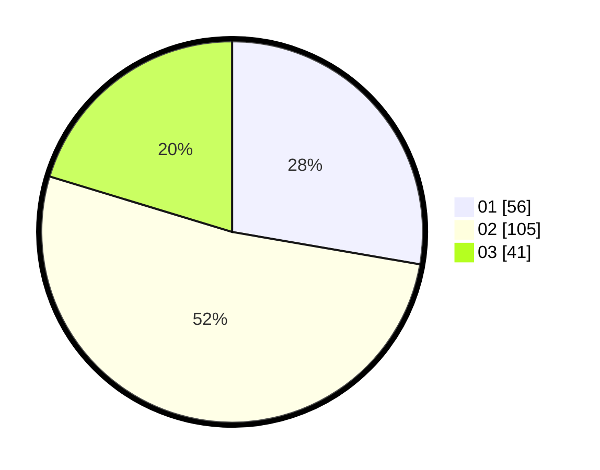

# Hasil

Hasil perolehan suara paslon dapat dilihat pada file paslon-01.txt, paslon-02.txt, dan paslon-03.txt.

Jika tidak ada, artinya data tersebut belum ada pada SIREKAP.

## Perolehan Suara

 * Paslon 01: **56**.
 * Paslon 02: **105**.
 * Paslon 03: **41**.

## Foto C Plano

https://sirekap-obj-formc.kpu.go.id/4c65/pemilu/ppwp/31/72/02/10/04/3172021004032-20240217-231913--6aaf33eb-f017-4ba2-86ab-7c6a880a825a.jpg

https://sirekap-obj-formc.kpu.go.id/4c65/pemilu/ppwp/31/72/02/10/04/3172021004032-20240217-232259--7a666133-deec-4b9d-860f-9b244cc15788.jpg
