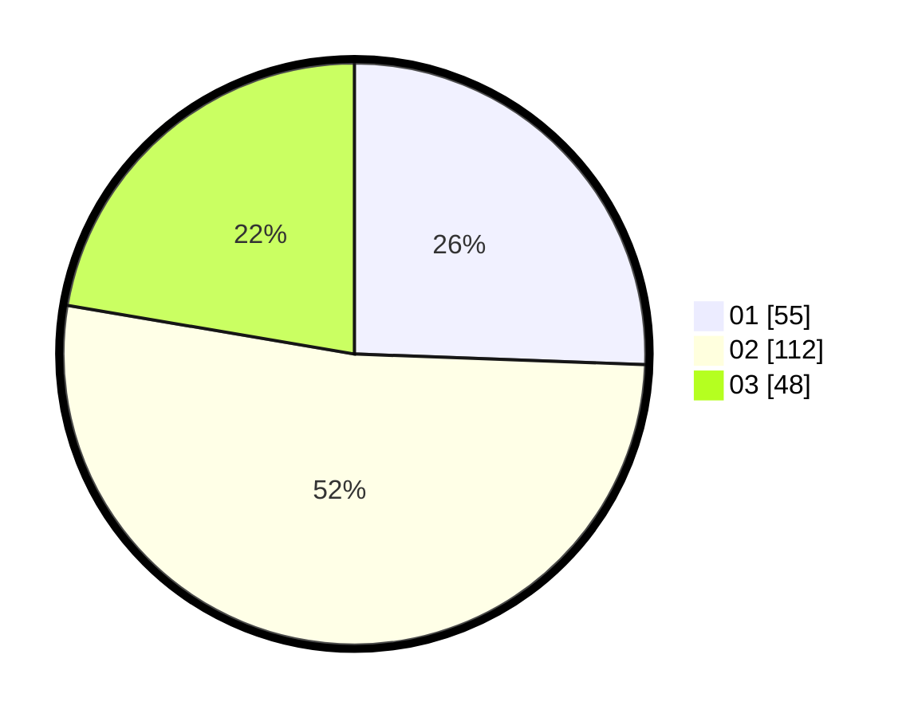

# Hasil

Hasil perolehan suara paslon dapat dilihat pada file paslon-01.txt, paslon-02.txt, dan paslon-03.txt.

Jika tidak ada, artinya data tersebut belum ada pada SIREKAP.

## Perolehan Suara

 * Paslon 01: **55**.
 * Paslon 02: **112**.
 * Paslon 03: **48**.

## Foto C Plano

https://sirekap-obj-formc.kpu.go.id/6fd6/pemilu/ppwp/31/72/02/10/04/3172021004041-20240214-194113--11c7b9bb-7d37-492c-8a16-712b48bc0b84.jpg

https://sirekap-obj-formc.kpu.go.id/6fd6/pemilu/ppwp/31/72/02/10/04/3172021004041-20240214-194330--2f125cc4-fa4c-4822-9939-7406e4528fbb.jpg
