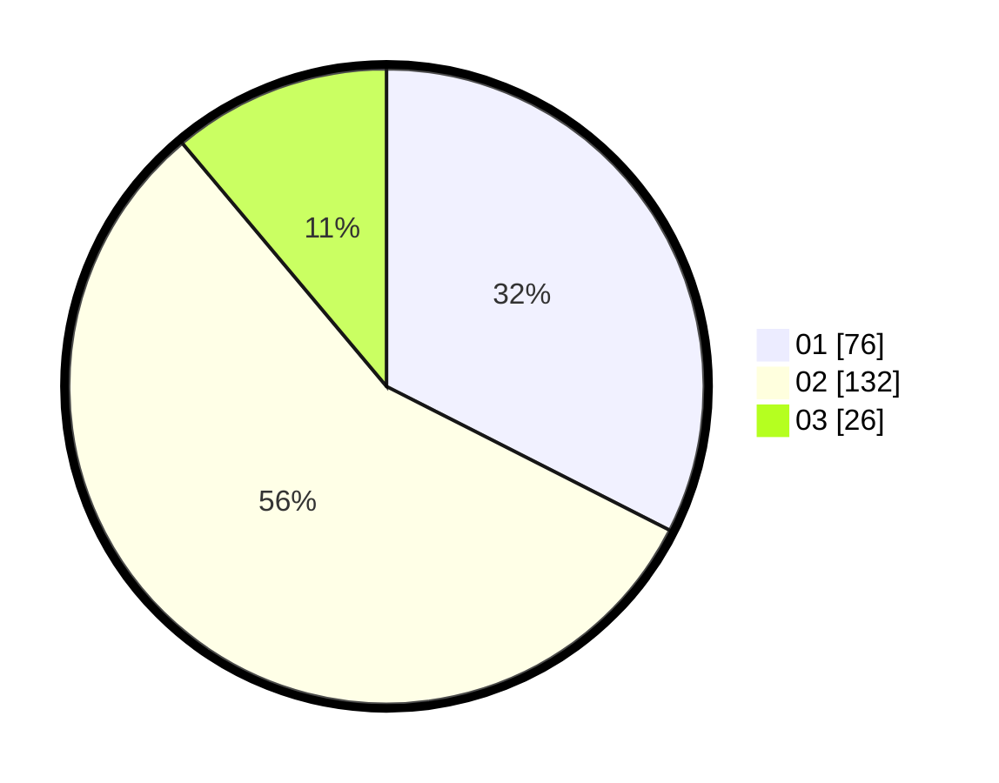

# Hasil

Hasil perolehan suara paslon dapat dilihat pada file paslon-01.txt, paslon-02.txt, dan paslon-03.txt.

Jika tidak ada, artinya data tersebut belum ada pada SIREKAP.

## Perolehan Suara

 * Paslon 01: **76**.
 * Paslon 02: **132**.
 * Paslon 03: **26**.

## Foto C Plano

https://sirekap-obj-formc.kpu.go.id/b415/pemilu/ppwp/31/72/02/10/04/3172021004052-20240214-160133--cc87c63d-35af-40bd-8acd-b2cbd18d9a4f.jpg

https://sirekap-obj-formc.kpu.go.id/b415/pemilu/ppwp/31/72/02/10/04/3172021004052-20240214-190219--8f260bb8-cac7-4e1e-b896-4ff993eccccc.jpg

https://sirekap-obj-formc.kpu.go.id/b415/pemilu/ppwp/31/72/02/10/04/3172021004052-20240214-190227--ba6a1072-52ac-47c8-83a8-ee4d8b5a14e2.jpg

## DATA PEMILIH TETAP

Jumlah pemilih dalam DPT: **240**.
 * L: **115**.
 * P: **125**.

## DATA PENGGUNA HAK PILIH

Jumlah pengguna hak pilih dalam DPT: **234**.
 * L: **111**.
 * P: **123**.

Jumlah pengguna hak pilih dalam DPTb: **3**.
 * L: **2**.
 * P: **1**.

Jumlah pengguna hak pilih dalam DPK: **3**.
 * L: **2**.
 * P: **1**.

Jumlah pengguna hak pilih: **240**.
 * L: **115**.
 * P: **125**.

## JUMLAH SUARA SAH DAN TIDAK SAH

JUMLAH SELURUH SUARA SAH: **234**.

JUMLAH SUARA TIDAK SAH: **6**.

JUMLAH SELURUH SUARA SAH DAN SUARA TIDAK SAH: **240**.
