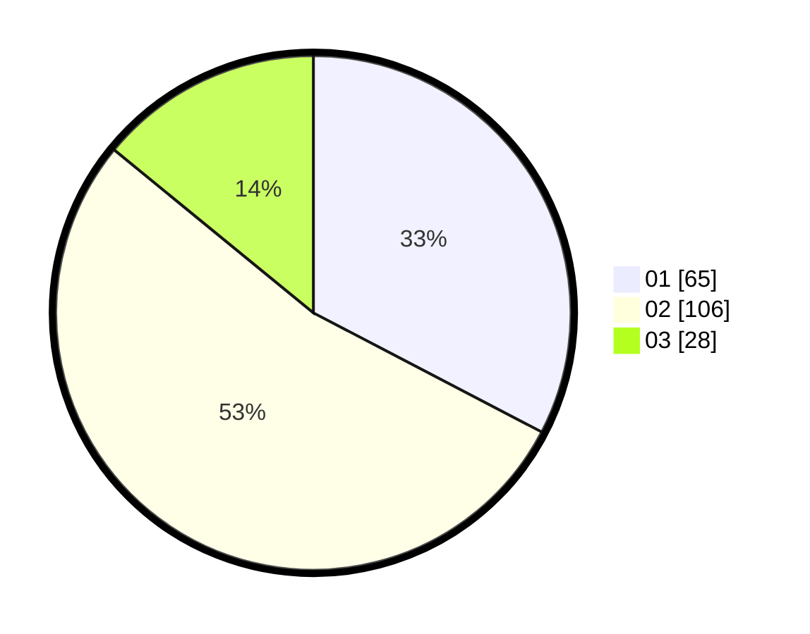

# Hasil

Hasil perolehan suara paslon dapat dilihat pada file paslon-01.txt, paslon-02.txt, dan paslon-03.txt.

Jika tidak ada, artinya data tersebut belum ada pada SIREKAP.

## Perolehan Suara

 * Paslon 01: **65**.
 * Paslon 02: **106**.
 * Paslon 03: **28**.

## Foto C Plano

https://sirekap-obj-formc.kpu.go.id/efc6/pemilu/ppwp/31/72/02/10/04/3172021004073-20240214-204935--17f5fb7e-eb45-4aff-9b86-901cb11d9af2.jpg

https://sirekap-obj-formc.kpu.go.id/efc6/pemilu/ppwp/31/72/02/10/04/3172021004073-20240214-215130--7cfc3952-95a2-436d-b8ed-ad005c2803c4.jpg

https://sirekap-obj-formc.kpu.go.id/efc6/pemilu/ppwp/31/72/02/10/04/3172021004073-20240214-205338--5bdf71a8-2943-4347-a3dc-81176abd3301.jpg

## DATA PEMILIH TETAP

Jumlah pemilih dalam DPT: **286**.
 * L: **133**.
 * P: **153**.

## DATA PENGGUNA HAK PILIH

Jumlah pengguna hak pilih dalam DPT: **203**.
 * L: **91**.
 * P: **112**.

Jumlah pengguna hak pilih dalam DPTb: **0**.
 * L: **0**.
 * P: **0**.

Jumlah pengguna hak pilih dalam DPK: **1**.
 * L: **1**.
 * P: **0**.

Jumlah pengguna hak pilih: **204**.
 * L: **92**.
 * P: **112**.

## JUMLAH SUARA SAH DAN TIDAK SAH

JUMLAH SELURUH SUARA SAH: **199**.

JUMLAH SUARA TIDAK SAH: **5**.

JUMLAH SELURUH SUARA SAH DAN SUARA TIDAK SAH: **204**.
