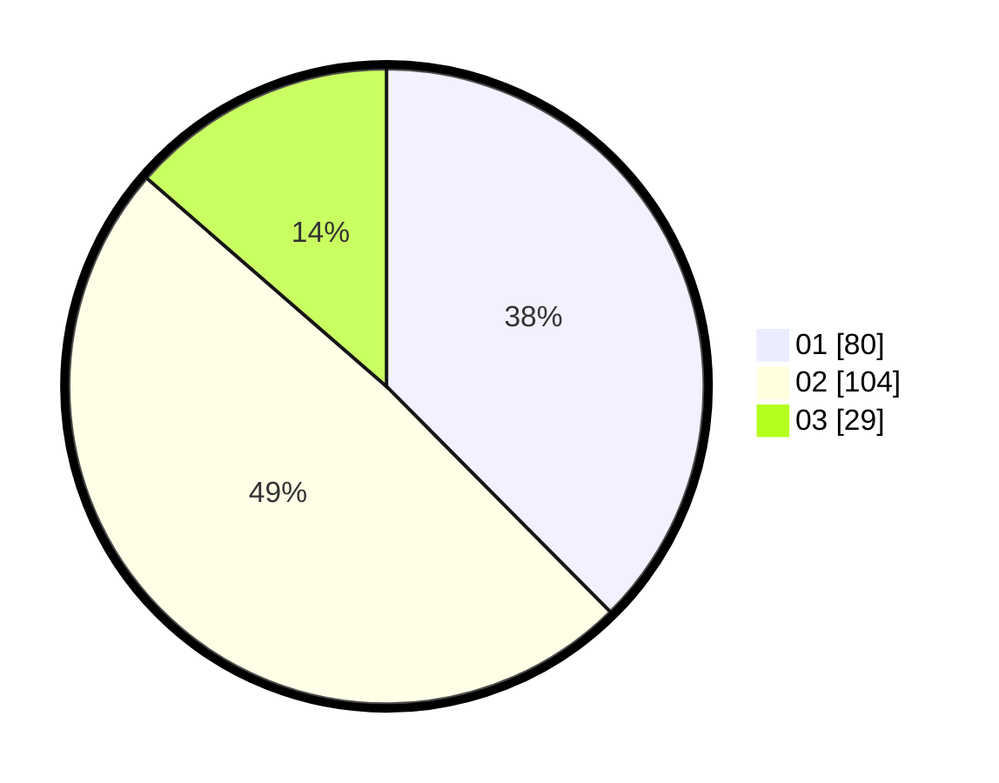

# Hasil

Hasil perolehan suara paslon dapat dilihat pada file paslon-01.txt, paslon-02.txt, dan paslon-03.txt.

Jika tidak ada, artinya data tersebut belum ada pada SIREKAP.

## Perolehan Suara

 * Paslon 01: **80**.
 * Paslon 02: **104**.
 * Paslon 03: **29**.

## Foto C Plano

https://sirekap-obj-formc.kpu.go.id/0006/pemilu/ppwp/31/72/02/10/04/3172021004078-20240215-035459--53ff9430-c276-4aa8-88b1-d3323b7d2956.jpg

https://sirekap-obj-formc.kpu.go.id/0006/pemilu/ppwp/31/72/02/10/04/3172021004078-20240214-225218--c4302e86-e0c6-442c-b9d3-90eeceb213c8.jpg

https://sirekap-obj-formc.kpu.go.id/0006/pemilu/ppwp/31/72/02/10/04/3172021004078-20240215-035615--c7fe0568-6635-4d3b-ad7b-de7820505dbc.jpg

## DATA PEMILIH TETAP

Jumlah pemilih dalam DPT: **293**.
 * L: **150**.
 * P: **143**.

## DATA PENGGUNA HAK PILIH

Jumlah pengguna hak pilih dalam DPT: **213**.
 * L: **110**.
 * P: **103**.

Jumlah pengguna hak pilih dalam DPTb: **0**.
 * L: **0**.
 * P: **0**.

Jumlah pengguna hak pilih dalam DPK: **6**.
 * L: **2**.
 * P: **4**.

Jumlah pengguna hak pilih: **219**.
 * L: **112**.
 * P: **107**.

## JUMLAH SUARA SAH DAN TIDAK SAH

JUMLAH SELURUH SUARA SAH: **213**.

JUMLAH SUARA TIDAK SAH: **6**.

JUMLAH SELURUH SUARA SAH DAN SUARA TIDAK SAH: **219**.
