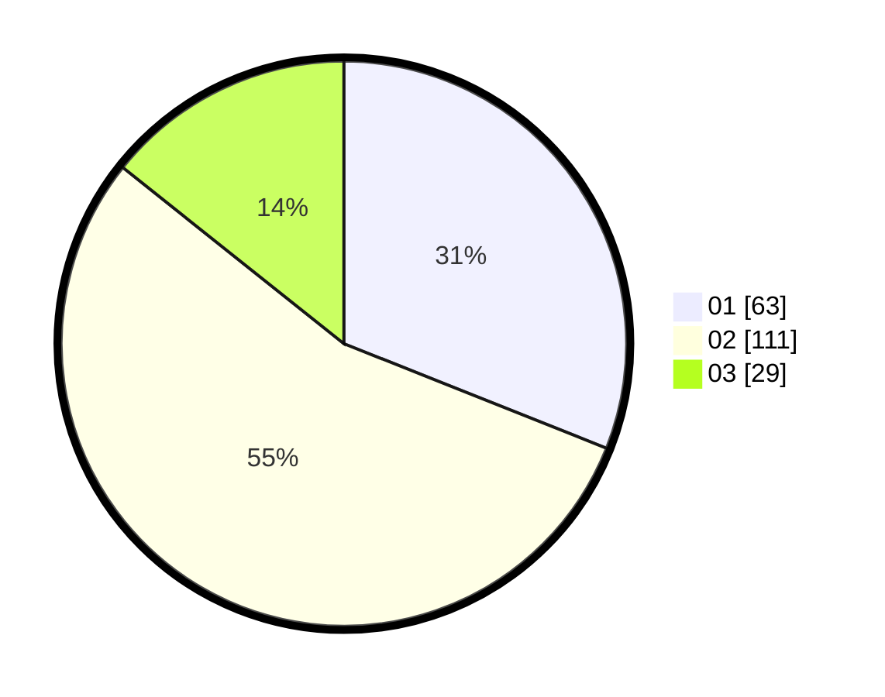

# Hasil

Hasil perolehan suara paslon dapat dilihat pada file paslon-01.txt, paslon-02.txt, dan paslon-03.txt.

Jika tidak ada, artinya data tersebut belum ada pada SIREKAP.

## Perolehan Suara

 * Paslon 01: **63**.
 * Paslon 02: **111**.
 * Paslon 03: **29**.

## Foto C Plano

https://sirekap-obj-formc.kpu.go.id/62af/pemilu/ppwp/31/72/02/10/04/3172021004085-20240214-192806--e1e31617-732f-40ba-bed1-b875b92b3b89.jpg

https://sirekap-obj-formc.kpu.go.id/62af/pemilu/ppwp/31/72/02/10/04/3172021004085-20240214-192543--f2675b9e-1250-4f5c-a33a-5cf2709a7ba9.jpg

https://sirekap-obj-formc.kpu.go.id/62af/pemilu/ppwp/31/72/02/10/04/3172021004085-20240214-155412--7cff502a-327f-4782-97cf-86cf637a3fdb.jpg

## DATA PEMILIH TETAP

Jumlah pemilih dalam DPT: **296**.
 * L: **153**.
 * P: **143**.

## DATA PENGGUNA HAK PILIH

Jumlah pengguna hak pilih dalam DPT: **197**.
 * L: **97**.
 * P: **100**.

Jumlah pengguna hak pilih dalam DPTb: **6**.
 * L: **3**.
 * P: **3**.

Jumlah pengguna hak pilih dalam DPK: **3**.
 * L: **2**.
 * P: **1**.

Jumlah pengguna hak pilih: **206**.
 * L: **102**.
 * P: **104**.

## JUMLAH SUARA SAH DAN TIDAK SAH

JUMLAH SELURUH SUARA SAH: **203**.

JUMLAH SUARA TIDAK SAH: **3**.

JUMLAH SELURUH SUARA SAH DAN SUARA TIDAK SAH: **206**.
