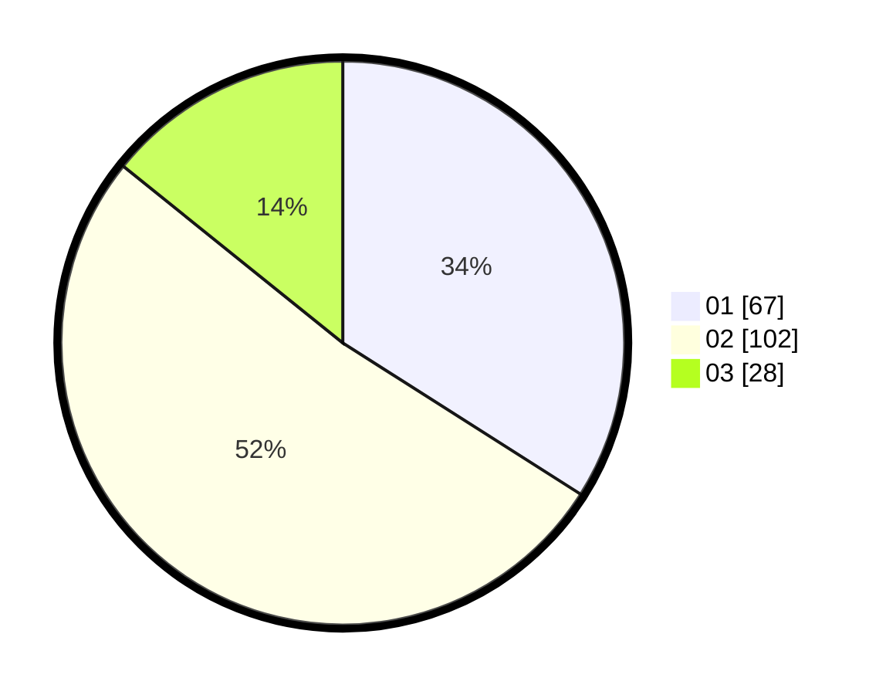

# Hasil

Hasil perolehan suara paslon dapat dilihat pada file paslon-01.txt, paslon-02.txt, dan paslon-03.txt.

Jika tidak ada, artinya data tersebut belum ada pada SIREKAP.

## Perolehan Suara

 * Paslon 01: **67**.
 * Paslon 02: **102**.
 * Paslon 03: **28**.

## Foto C Plano

https://sirekap-obj-formc.kpu.go.id/0de2/pemilu/ppwp/31/72/02/10/04/3172021004095-20240214-185257--c7b92a37-34cd-4cda-992a-672bf22b517b.jpg

https://sirekap-obj-formc.kpu.go.id/0de2/pemilu/ppwp/31/72/02/10/04/3172021004095-20240214-185218--5e5d2b14-62c0-458c-8e03-e008e99962ac.jpg

https://sirekap-obj-formc.kpu.go.id/0de2/pemilu/ppwp/31/72/02/10/04/3172021004095-20240214-185231--90202321-fe49-4d7c-95f7-cf0e2bf0e6eb.jpg

## DATA PEMILIH TETAP

Jumlah pemilih dalam DPT: **290**.
 * L: **178**.
 * P: **112**.

## DATA PENGGUNA HAK PILIH

Jumlah pengguna hak pilih dalam DPT: **182**.
 * L: **105**.
 * P: **77**.

Jumlah pengguna hak pilih dalam DPTb: **17**.
 * L: **10**.
 * P: **7**.

Jumlah pengguna hak pilih dalam DPK: **0**.
 * L: **0**.
 * P: **0**.

Jumlah pengguna hak pilih: **199**.
 * L: **115**.
 * P: **84**.

## JUMLAH SUARA SAH DAN TIDAK SAH

JUMLAH SELURUH SUARA SAH: **197**.

JUMLAH SUARA TIDAK SAH: **2**.

JUMLAH SELURUH SUARA SAH DAN SUARA TIDAK SAH: **199**.
