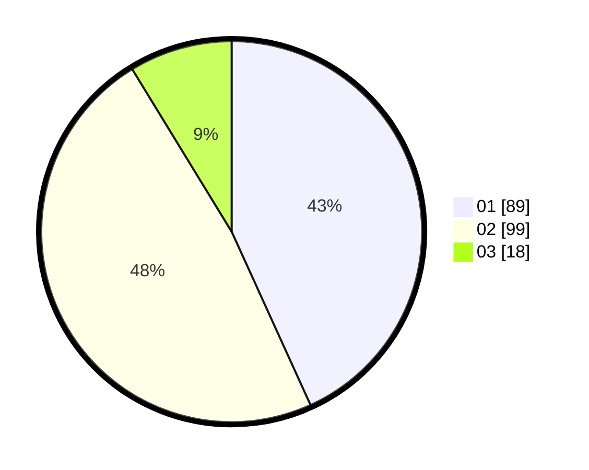

# Hasil

Hasil perolehan suara paslon dapat dilihat pada file paslon-01.txt, paslon-02.txt, dan paslon-03.txt.

Jika tidak ada, artinya data tersebut belum ada pada SIREKAP.

## Perolehan Suara

 * Paslon 01: **89**.
 * Paslon 02: **99**.
 * Paslon 03: **18**.

## Foto C Plano

https://sirekap-obj-formc.kpu.go.id/3acc/pemilu/ppwp/31/72/02/10/05/3172021005011-20240214-215909--7aaf84c3-1401-45c8-8453-b6690d5c55bf.jpg

https://sirekap-obj-formc.kpu.go.id/3acc/pemilu/ppwp/31/72/02/10/05/3172021005011-20240214-215928--cf084961-618e-4d3d-885b-b250452548e7.jpg

https://sirekap-obj-formc.kpu.go.id/3acc/pemilu/ppwp/31/72/02/10/05/3172021005011-20240214-215934--3f3525f1-42bc-469d-af71-6b2f5520268f.jpg

## DATA PEMILIH TETAP

Jumlah pemilih dalam DPT: **284**.
 * L: **143**.
 * P: **141**.

## DATA PENGGUNA HAK PILIH

Jumlah pengguna hak pilih dalam DPT: **209**.
 * L: **102**.
 * P: **107**.

Jumlah pengguna hak pilih dalam DPTb: **2**.
 * L: **0**.
 * P: **2**.

Jumlah pengguna hak pilih dalam DPK: **0**.
 * L: **0**.
 * P: **0**.

Jumlah pengguna hak pilih: **211**.
 * L: **102**.
 * P: **109**.

## JUMLAH SUARA SAH DAN TIDAK SAH

JUMLAH SELURUH SUARA SAH: **206**.

JUMLAH SUARA TIDAK SAH: **5**.

JUMLAH SELURUH SUARA SAH DAN SUARA TIDAK SAH: **211**.
