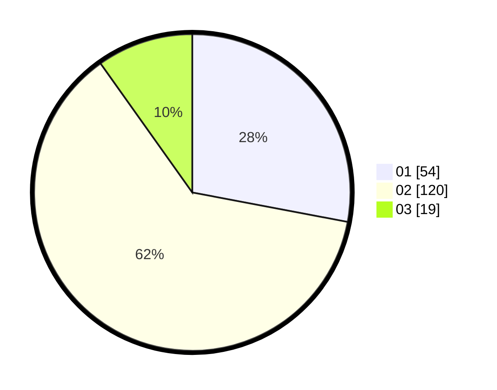

# Hasil

Hasil perolehan suara paslon dapat dilihat pada file paslon-01.txt, paslon-02.txt, dan paslon-03.txt.

Jika tidak ada, artinya data tersebut belum ada pada SIREKAP.

## Perolehan Suara

 * Paslon 01: **54**.
 * Paslon 02: **120**.
 * Paslon 03: **19**.

## Foto C Plano

https://sirekap-obj-formc.kpu.go.id/90a1/pemilu/ppwp/31/72/02/10/05/3172021005019-20240214-191421--de546ae6-4cd5-44fd-8874-82cca73b06f9.jpg

https://sirekap-obj-formc.kpu.go.id/90a1/pemilu/ppwp/31/72/02/10/05/3172021005019-20240214-194712--719a8041-9dda-4f91-8b2b-91076ac8f1da.jpg

https://sirekap-obj-formc.kpu.go.id/90a1/pemilu/ppwp/31/72/02/10/05/3172021005019-20240214-233041--ffd36ec1-b218-4cac-b922-3c1f55343171.jpg

## DATA PEMILIH TETAP

Jumlah pemilih dalam DPT: **290**.
 * L: **144**.
 * P: **146**.

## DATA PENGGUNA HAK PILIH

Jumlah pengguna hak pilih dalam DPT: **204**.
 * L: **89**.
 * P: **115**.

Jumlah pengguna hak pilih dalam DPTb: **0**.
 * L: **0**.
 * P: **0**.

Jumlah pengguna hak pilih dalam DPK: **1**.
 * L: **1**.
 * P: **0**.

Jumlah pengguna hak pilih: **205**.
 * L: **90**.
 * P: **115**.

## JUMLAH SUARA SAH DAN TIDAK SAH

JUMLAH SELURUH SUARA SAH: **203**.

JUMLAH SUARA TIDAK SAH: **2**.

JUMLAH SELURUH SUARA SAH DAN SUARA TIDAK SAH: **205**.
