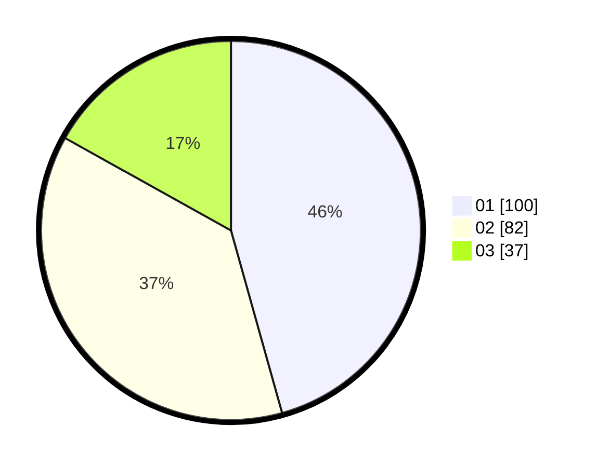

# Hasil

Hasil perolehan suara paslon dapat dilihat pada file paslon-01.txt, paslon-02.txt, dan paslon-03.txt.

Jika tidak ada, artinya data tersebut belum ada pada SIREKAP.

## Perolehan Suara

 * Paslon 01: **100**.
 * Paslon 02: **82**.
 * Paslon 03: **37**.

## Foto C Plano

https://sirekap-obj-formc.kpu.go.id/1132/pemilu/ppwp/31/72/02/10/05/3172021005100-20240214-220557--8b9ea8c3-6fa1-4fc5-bcf3-8f89b6b0dead.jpg

https://sirekap-obj-formc.kpu.go.id/1132/pemilu/ppwp/31/72/02/10/05/3172021005100-20240214-222012--1cc76031-0039-4d4b-8b9c-f551d8b0b32e.jpg

https://sirekap-obj-formc.kpu.go.id/1132/pemilu/ppwp/31/72/02/10/05/3172021005100-20240214-222215--fdd408b7-71a2-4fa0-8926-abb292b10ad8.jpg

## DATA PEMILIH TETAP

Jumlah pemilih dalam DPT: **294**.
 * L: **141**.
 * P: **153**.

## DATA PENGGUNA HAK PILIH

Jumlah pengguna hak pilih dalam DPT: **214**.
 * L: **92**.
 * P: **122**.

Jumlah pengguna hak pilih dalam DPTb: **2**.
 * L: **1**.
 * P: **1**.

Jumlah pengguna hak pilih dalam DPK: **5**.
 * L: **1**.
 * P: **4**.

Jumlah pengguna hak pilih: **221**.
 * L: **94**.
 * P: **127**.

## JUMLAH SUARA SAH DAN TIDAK SAH

JUMLAH SELURUH SUARA SAH: **519**.

JUMLAH SUARA TIDAK SAH: **2**.

JUMLAH SELURUH SUARA SAH DAN SUARA TIDAK SAH: **221**.
