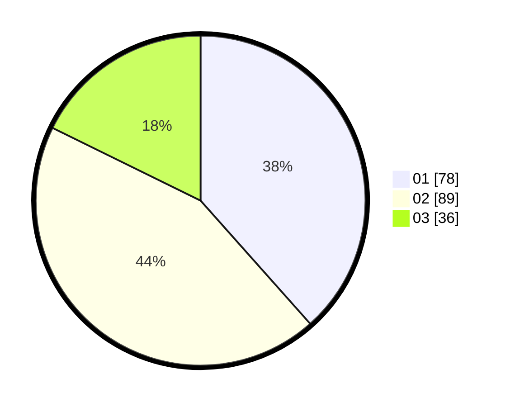

# Hasil

Hasil perolehan suara paslon dapat dilihat pada file paslon-01.txt, paslon-02.txt, dan paslon-03.txt.

Jika tidak ada, artinya data tersebut belum ada pada SIREKAP.

## Perolehan Suara

 * Paslon 01: **78**.
 * Paslon 02: **89**.
 * Paslon 03: **36**.

## Foto C Plano

https://sirekap-obj-formc.kpu.go.id/6e6c/pemilu/ppwp/31/72/02/10/06/3172021006005-20240214-203734--98e53ce2-51bb-433c-a287-cbeb24918b1c.jpg

https://sirekap-obj-formc.kpu.go.id/6e6c/pemilu/ppwp/31/72/02/10/06/3172021006005-20240214-204426--6ea8c4df-8974-4d8f-b762-cb494c5f59f0.jpg

https://sirekap-obj-formc.kpu.go.id/6e6c/pemilu/ppwp/31/72/02/10/06/3172021006005-20240214-204509--aff3e389-ffcd-4fc3-b4e8-713b165e4a17.jpg

## DATA PEMILIH TETAP

Jumlah pemilih dalam DPT: **297**.
 * L: **149**.
 * P: **148**.

## DATA PENGGUNA HAK PILIH

Jumlah pengguna hak pilih dalam DPT: **201**.
 * L: **93**.
 * P: **108**.

Jumlah pengguna hak pilih dalam DPTb: **2**.
 * L: **1**.
 * P: **1**.

Jumlah pengguna hak pilih dalam DPK: **0**.
 * L: **0**.
 * P: **0**.

Jumlah pengguna hak pilih: **203**.
 * L: **94**.
 * P: **109**.

## JUMLAH SUARA SAH DAN TIDAK SAH

JUMLAH SELURUH SUARA SAH: **203**.

JUMLAH SUARA TIDAK SAH: **0**.

JUMLAH SELURUH SUARA SAH DAN SUARA TIDAK SAH: **203**.
