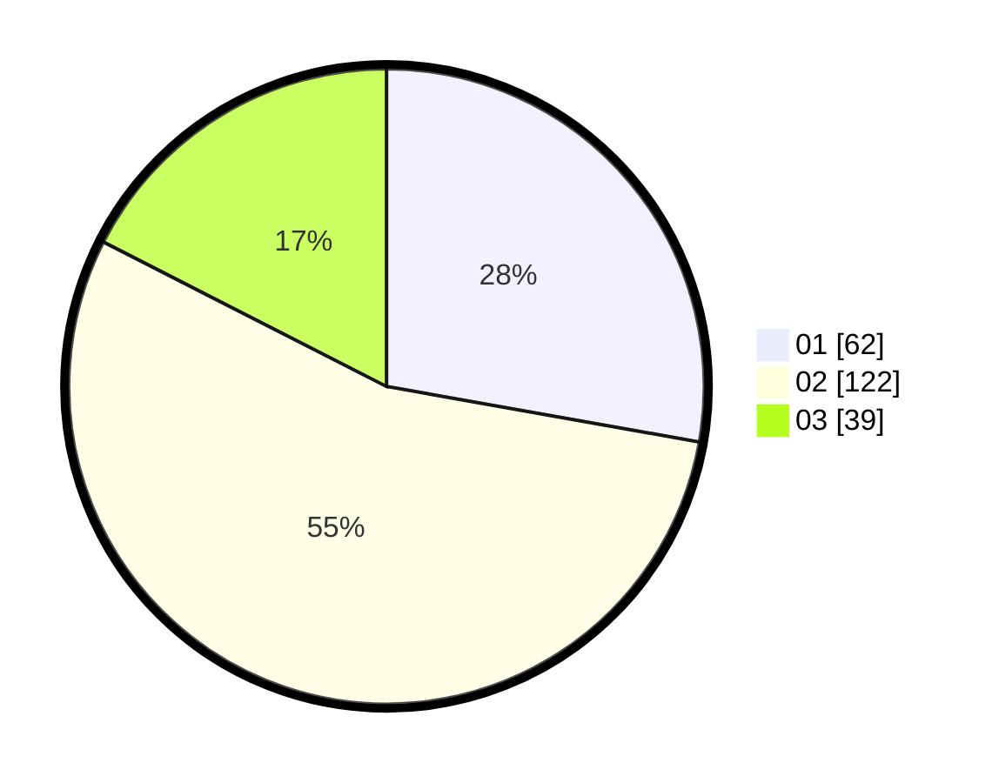

# Hasil

Hasil perolehan suara paslon dapat dilihat pada file paslon-01.txt, paslon-02.txt, dan paslon-03.txt.

Jika tidak ada, artinya data tersebut belum ada pada SIREKAP.

## Perolehan Suara

 * Paslon 01: **62**.
 * Paslon 02: **122**.
 * Paslon 03: **39**.

## Foto C Plano

https://sirekap-obj-formc.kpu.go.id/df9f/pemilu/ppwp/31/72/02/10/06/3172021006007-20240217-115854--aff93781-149e-4987-8eff-85f62748fc21.jpg

https://sirekap-obj-formc.kpu.go.id/df9f/pemilu/ppwp/31/72/02/10/06/3172021006007-20240217-115131--5db3278d-8334-4a10-af9d-8ddd797a26d9.jpg

https://sirekap-obj-formc.kpu.go.id/df9f/pemilu/ppwp/31/72/02/10/06/3172021006007-20240217-115712--6694041e-9f4f-4e10-9231-4eb5301d24fb.jpg

## DATA PEMILIH TETAP

Jumlah pemilih dalam DPT: **294**.
 * L: **165**.
 * P: **129**.

## DATA PENGGUNA HAK PILIH

Jumlah pengguna hak pilih dalam DPT: **217**.
 * L: **116**.
 * P: **101**.

Jumlah pengguna hak pilih dalam DPTb: **4**.
 * L: **4**.
 * P: **0**.

Jumlah pengguna hak pilih dalam DPK: **3**.
 * L: **1**.
 * P: **2**.

Jumlah pengguna hak pilih: **224**.
 * L: **121**.
 * P: **103**.

## JUMLAH SUARA SAH DAN TIDAK SAH

JUMLAH SELURUH SUARA SAH: **223**.

JUMLAH SUARA TIDAK SAH: **1**.

JUMLAH SELURUH SUARA SAH DAN SUARA TIDAK SAH: **224**.
